# Урок 12.5. Непосредственный подсчет голосов

Перед началом непосредственного подсчета голосов избирателей председатель участковой комиссии проверяет отсутствие письменных принадлежностей у членов участковой комиссии с правом решающего голоса.

## 12.5.1. Подсчет голосов избирателей в переносных ящиках для голосования

В первую очередь производится подсчет бюллетеней, находящихся в переносных ящиках для голосования. Членами комиссии проверяется неповрежденность печатей (пломб) на всех переносных ящиках. Они предъявляются всем присутствующим в помещении для голосования для визуального ознакомления.

Вскрытию каждого переносного ящика предшествует объявление числа избирателей, проголосовавших с использованием данного переносного ящика для голосования.

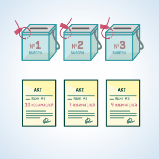

#### Рисунок 12.5.1. Пред вскрытием каждого переносного ящика проверяется целостность пломб, они предъявляются всем присутствующим для визуального ознакомления, а также оглашаются данные Акта о количестве избирателей, проголосовавших с использованием данного переносного ящика.

Члены комиссии вскрывают переносной ящик, подсчитывают и оглашают число избирательных бюллетеней установленной формы, содержащихся в данном переносном ящике. 

Подсчет бюллетеней ведется таким образом, чтобы не нарушалась тайна голосования, при этом отделяются избирательные бюллетени неустановленной формы. 

Избирательные бюллетени неустановленной формы при непосредственном подсчете голосов не учитываются.

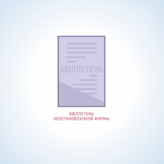

#### Рисунок 12.5.2. Бюллетень неустановленной формы.

При выявлении избирательных бюллетеней неустановленной формы составляется акт, и они упаковываются в отдельную пачку.

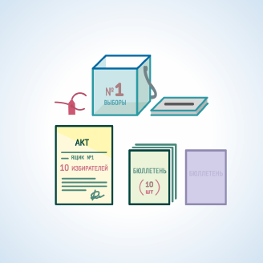

#### Рисунок 12.5.3. Об обнаружении бюллетеней неустановленной формы составляется акт. Такие бюллетени складываются в отдельную пачку.

Если в данном переносном ящике число обнаруженных избирательных бюллетеней установленной формы не превышает предварительно объявленного числа избирателей, проголосовавших с использованием данного переносного ящика для голосования, участковая комиссия приступает к вскрытию следующего переносного ящика.

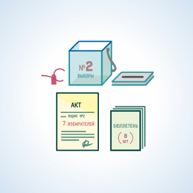

#### Рисунок 12.5.4. Число обнаруженных в переносном ящике бюллетеней превышает число избирателей, проголосовавших с использованием этого переносного ящика, указанное в Акте.

Если в переносном ящике обнаружено бюллетеней установленной формы больше, чем количество заявлений избирателей о предоставлении им возможности проголосовать вне помещения с отметками о получении избирательных бюллетеней, все бюллетени, находившиеся в данном переносном ящике, признаются недействительными, о чем составляется акт. 

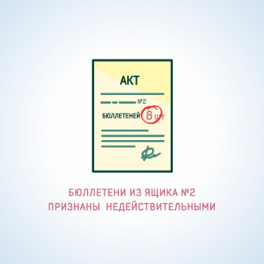

#### Рисунок 12.5.5. В случае превышения числа обнаруженных бюллетеней в переносном ящике над заявленным в Акте числом избирателей, проголосовавших с использованием этого ящика, все обнаруженные бюллетени признаются недействительными, о чем составляется Акт.

В акте указываются фамилии и инициалы членов комиссии, обеспечивавших проведение голосования вне помещения для голосования с использованием данного переносного ящика. Число признанных в этом случае недействительными бюллетеней оглашается, вносится в указанный акт и впоследствии суммируется с числом недействительных бюллетеней, выявленных при сортировке бюллетеней. 

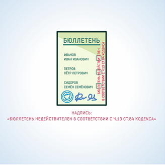

#### Рисунок 12.5.6. На лицевой стороне бюллетеня, признанного недействительным в связи с превышением числа обнаруженных бюллетеней над числом избирателей, проголосовавших с использованием данного переносного ящика, делается соответствующая надпись, которая заверяется подписями двух членов УИК и печатью УИК.

На лицевой стороне каждого из этих бюллетеней на квадратах, расположенных справа от данных кандидатов, вносится запись: «Бюллетень недействителен в соответствии с ч. 13 ст. 84 Кодекса», которая подтверждается подписями двух членов комиссии с правом решающего голоса и заверяется печатью комиссии, а сами бюллетени упаковываются отдельно, опечатываются и при дальнейшем подсчете не учитываются.

## 12.5.2. Вскрытие стационарных ящиков для голосования, сортировка избирательных бюллетеней

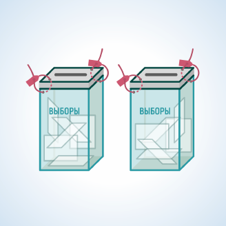

#### Рисунок 12.5.7. Перед вскрытием стационарных ящиков для голосования всем присутствующим предъявляется для визуального ознакомления целостность пломб.

Членами комиссии проверяется неповрежденность пломб на стационарных ящиках для голосования, они предъявляются всем присутствующим для визуального ознакомления и поочередно вскрываются. Извлеченные из них бюллетени смешиваются с бюллетенями из всех переносных ящиков.

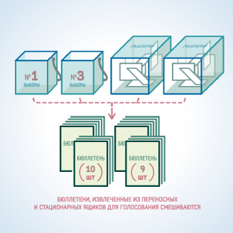

#### Рисунок 12.5.8. Перед непосредственным подсчетом голосов избирателей бюллетени, извлеченные из стационарных ящиков для голосования, смешиваются с бюллетенями из всех переносных ящиков для голосования.

## 12.5.3. Подсчет голосов избирателей, поданных за каждого кандидата (каждое избирательное объединение)

Члены комиссии сортируют, раскладывая в отдельные пачки, бюллетени, извлеченные из переносных и стационарных ящиков для голосования, по голосам, поданным за каждого из зарегистрированных кандидатов, одновременно отделяя бюллетени неустановленной формы, и недействительные избирательные бюллетени.

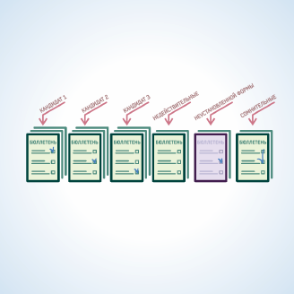

#### Рисунок 12.5.9. Бюллетени сортируются по голосам избирателей за кандидатов. Бюллетени неустановленный формы и недействительные бюллетени складываются в отдельные пачки.

В случае возникновения сомнений в определении волеизъявления избирателя избирательный бюллетень откладывается в отдельную пачку. 

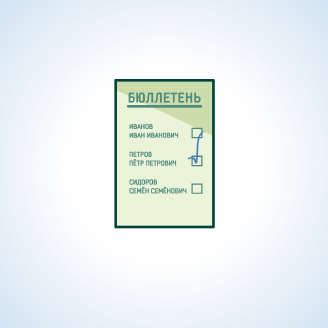

#### Рисунок 12.5.10. Если по отметке в бюллетене невозможно определить волеизъявление избирателя, то такой бюллетень откладывается в отдельную пачку для принятия решения путем голосования членов УИК.

По окончании сортировки участковая комиссия решает вопрос о действительности всех вызвавших сомнение бюллетеней путем голосования, при этом на оборотной стороне бюллетеня указываются причины признания его действительным или недействительным. 

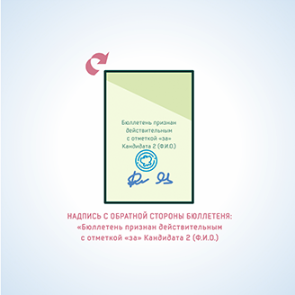

#### Рисунок 12.5.11. Члены УИК путем голосования определяют признать бюллетень действительным либо недействительным, если действительным, то в пользу какого кандидата. Результат голосования записывается на оборотной стороне такого бюллетеня. Эта запись подтверждается подписями не менее двух членов УИК и заверяется печатью УИК.

Эта запись подтверждается подписями не менее двух членов участковой комиссии и заверяется печатью участковой комиссии. Избирательный бюллетень, признанный действительным или недействительным, присоединяется к соответствующей пачке бюллетеней.

При сортировке избирательных бюллетеней члены комиссии оглашают содержащиеся в бюллетене отметки избирателя и представляют бюллетени для визуального контроля всем присутствующим. Одновременное оглашение содержания двух и более бюллетеней не допускается.

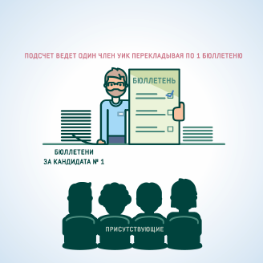

#### Рисунок 12.5.12. В рассортированных пачках бюллетени подсчитываются путем перекладывания по одному из одной стопки в другую таким образом, чтобы присутствующие при подсчете голосов избирателей могли видеть отметки избирателей в бюллетенях.

После сортировки бюллетеней проводится подсчет рассортированных избирательных бюллетеней установленной формы (в каждой пачке отдельно) по голосам избирателей, поданным за каждого из зарегистрированных кандидатов. При этом бюллетени подсчитываются путем перекладывания их по одному таким образом, чтобы лица, присутствующие при подсчете, могли видеть отметку избирателя в каждом бюллетене. Одновременный подсчет избирательных бюллетеней из разных пачек не допускается.
