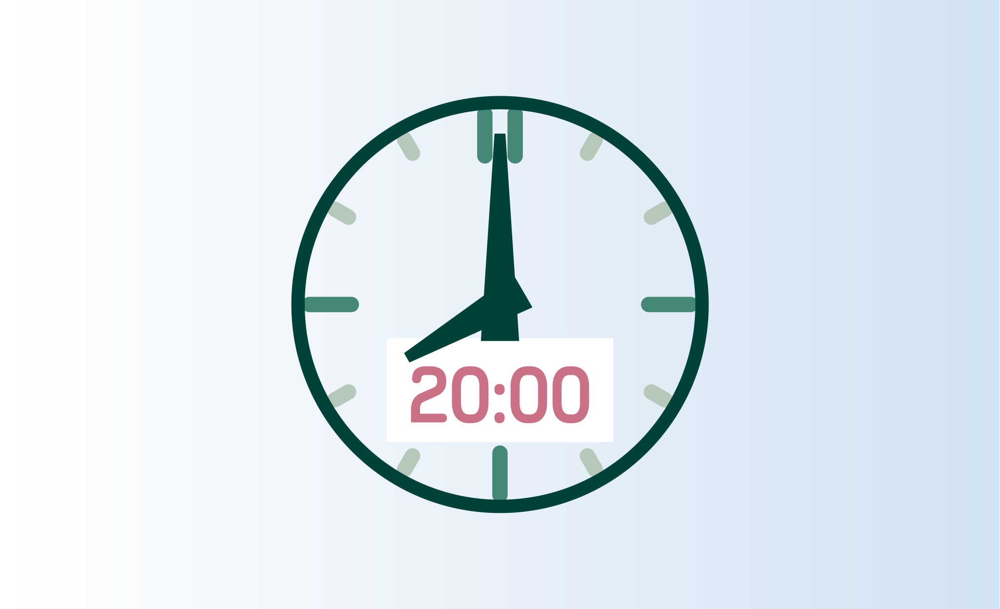
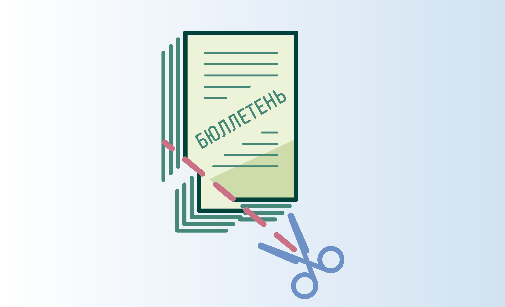
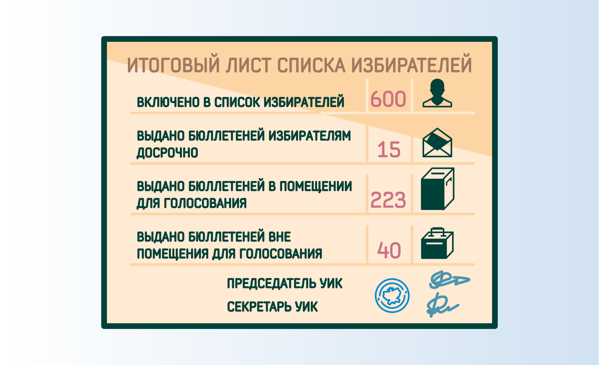
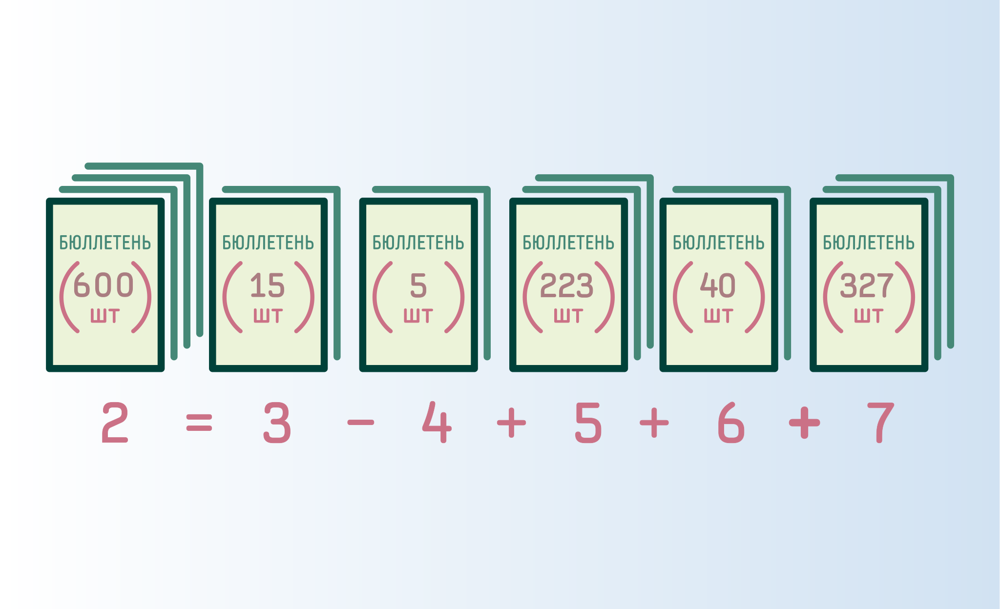
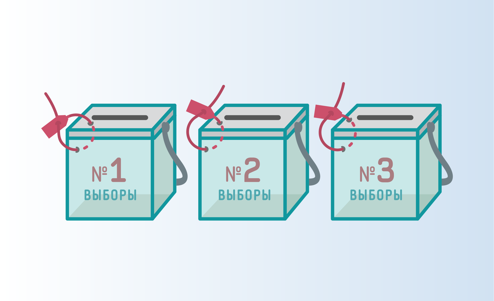
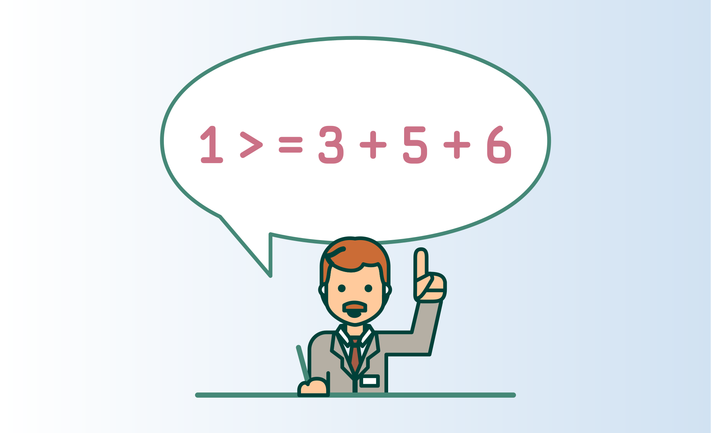
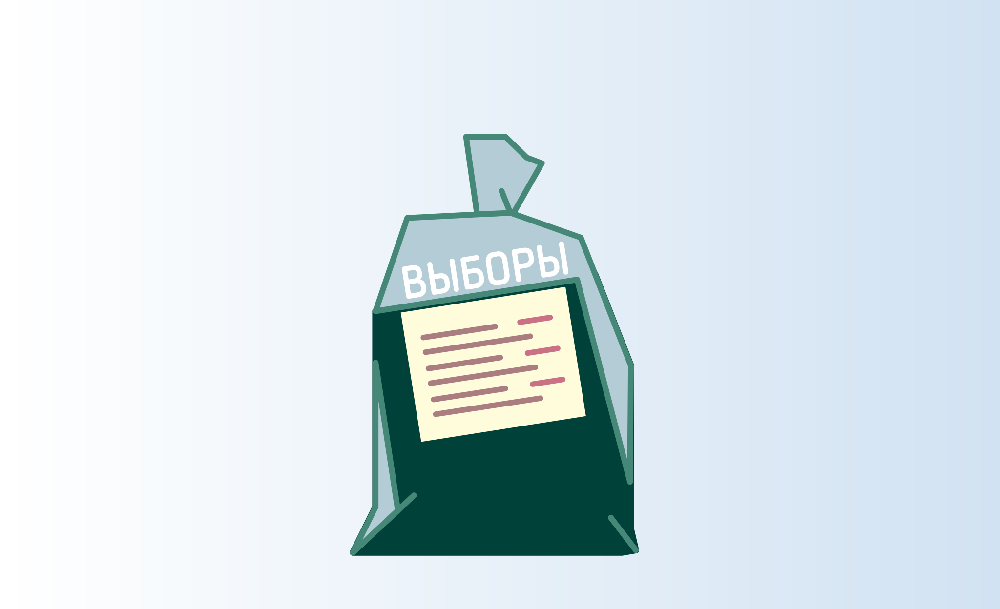

[Урок 12.1 - Действия членов участковой избирательной комиссии по окончании  времени голосования.](/kurs-4/12/12.1.md)

---

[Урок 12.2 - Погашение неиспользованных избирательных бюллетеней](/kurs-4/12/12.2.md)

---

[Урок 12.3 - Работа со списками избирателей](/kurs-4/12/12.3.md)

---

[Урок 12.4 - Промежуточная проверка контрольного соотношения](/kurs-4/12/12.4.md)

---

[Урок 12.5 - Непосредственный подсчет голосов](/kurs-4/12/12.5.md)

---

[Урок 12.6 - Проверка контрольных соотношений данных, внесенных в протокол об итогах голосования](/kurs-4/12/12.6.md)

---

[Урок 12.7 - Работа с избирательными бюллетенями](/kurs-4/12/12.7.md)