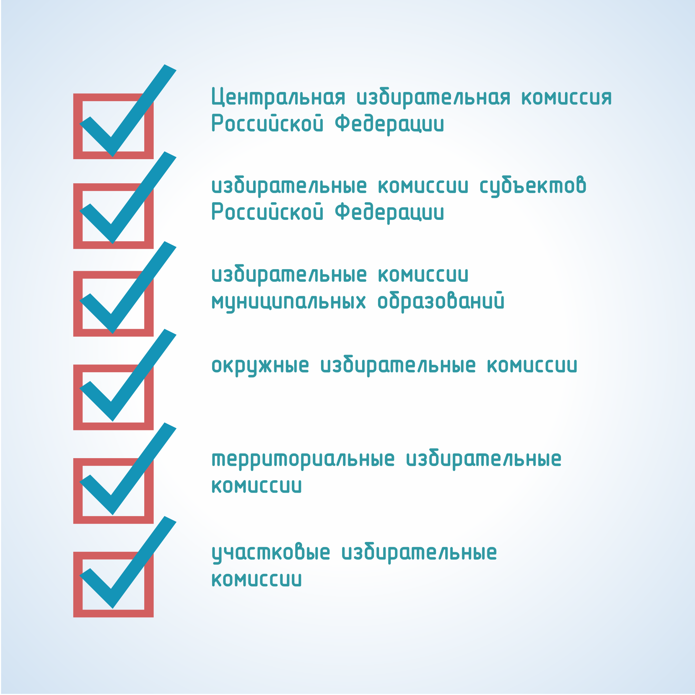

#### Урок 1.1. Система и статус избирательных комиссий в Российской Федерации {#lesson-1.01.1}

Избирательные комиссии являются коллегиальными органами, формируемыми в порядке и сроки, которые установлены законодательно, осуществляющими подготовку и проведение выборов, а также обеспечивающими реализацию и защиту избирательных прав граждан.

При проведении выборов действует строго определенная система избирательных комиссий, структура которой определяется уровнем и видом выборов – федеральный, региональный и местный (муниципальный).

В соответствии со статьей 21 Избирательного кодекса Хабаровского края подготовку и проведение выборов депутатов Думы осуществляют:

- избирательная комиссия края;
- окружные комиссии;
- территориальные комиссии;
- участковые комиссии.

Подготовку и проведение выборов Губернатора осуществляют:

- избирательная комиссия края;
- территориальные комиссии;
- участковые комиссии.

Подготовку и проведение выборов депутатов представительного органа муниципального образования осуществляют:

- комиссия муниципального образования;
- окружные комиссии;
- территориальные комиссии, сформированные в муниципальном образовании, имеющем районное деление;
- участковые комиссии.

Подготовку и проведение выборов главы муниципального образования осуществляют:

- комиссия муниципального образования;
- территориальные комиссии, сформированные в муниципальном образовании, имеющем районное деление;
- участковые комиссии.

Территориальная избирательная комиссия выполняет связующую роль на выборах любого уровня, между вышестоящими избирательными комиссиями и участковыми избирательными комиссиями.
