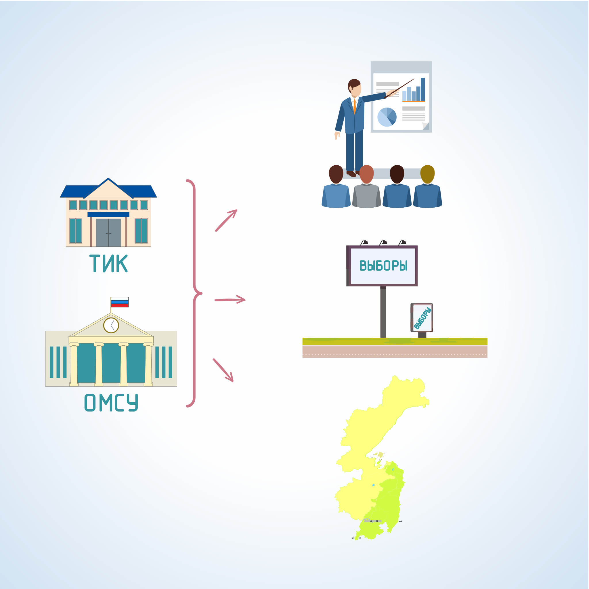

#### Урок 1.4. Направления совместной работы территориальной избирательной комиссии и органов местного самоуправления {#lesson-1.01.4}

Государственные органы края, органы местного самоуправления, учреждения, организации, предприятия с государственным участием, а также их должностные лица непосредственно не осуществляют подготовку и проведение выборов, а только оказывают содействие избирательным комиссиям в реализации их полномочий.

В соответствии с избирательным законодательством можно выделить следующие значимые направления совместной работы территориальной комиссии и органов местного самоуправления:

Организационные мероприятия: формирование избирательных комиссий; образование избирательных округов и избирательных участков; регистрация (учет) избирателей.

Информационное обеспечение выборов: обеспечение прав участников избирательного процесса на предвыборную агитацию; информирование избирателей, участников референдума.

Правовая сфера: повышение правовой культуры избирателей и организаторов выборов; защита избирательных прав граждан и контроль за соблюдением избирательного законодательства.

А также: в вопросах финансирования выборов (местного уровня), создании условий для работы избирательных комиссий и комплекса средств автоматизации ГАС «Выборы», обеспечения бесперебойной работы жилищно-коммунальных служб, обеспечения охраны общественного порядка, профилактики и ликвидации последствий чрезвычайных ситуаций на избирательных участках.
