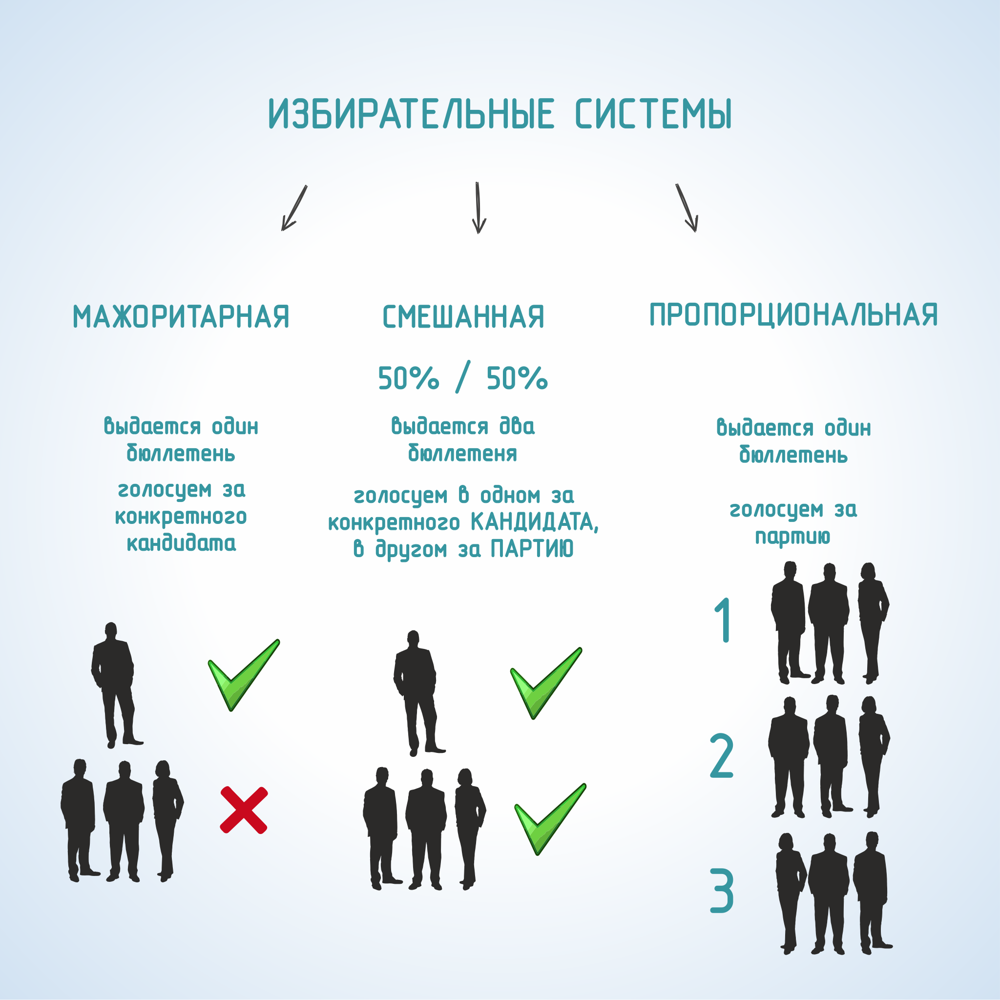

#### Урок 2.2. Основные избирательные системы, применяемые на выборах в Российской Федерации {#lesson-1.02.2}

Избирательная система – это порядок выборов органов государственной власти, органов местного самоуправления и их должностных лиц, избираемых непосредственно гражданами.

В Российской Федерации гражданами избираются: Президент РФ, депутаты Государственной Думы, депутаты законодательных (представительных) органов субъектов РФ, высшие должностные лица (руководители высших исполнительных органов) субъектов РФ (возможны выборы и в иные органы государственной власти), представительные органы муниципальных образований, возможны выборы глав муниципальных образований, других органов и должностных лиц местного самоуправления.

В зависимости от порядка определения результатов выборов, избирательные системы принято подразделять на:

- мажоритарные, основанные на принципе индивидуального представительства,
- пропорциональные, базирующиеся на принципе партийного представительства,
- смешанные (сочетают в себе механизмы индивидуального и партийного представительства).

Мажоритарная система – это система, при которой избранным считается тот кандидат, который набрал установленное законом большинство голосов. Мажоритарная система имеет разновидности, обусловленные различными требованиями к величине необходимого для избрания большинства голосов:

- мажоритарная система относительного большинства, где избранным считается кандидат, получивший на выборах больше голосов избирателей, чем его соперники;
- мажоритарная система абсолютного большинства, где избранным считается кандидат, набравший 50% голосов избирателей, принявших участие в голосовании, и еще 1 голос (так называемая формула «50%+1»). При отсутствии возможности определить победителя в первом туре голосования (если ни один из кандидатов, принимавших участие в выборах, не набрал 50%+1 голос избирателей), проводится повторное голосование.

Пропорциональная система (пропорциональное представительство партий и движений) – это порядок определения результатов выборов, при котором мандаты между партиями, выставившими своих кандидатов в представительный орган, распределяются в соответствии с полученными количеством голосов.

Голосование при пропорциональной системе проводится по многомандатным избирательным округам, в которых соперничают списки кандидатов, выдвинутые политическими партиями и движениями. Избиратель выбирает не между персонами, как при мажоритарной системе, а между партиями (движениями) и голосует за список кандидатов. Разделяют пропорциональную систему с открытыми или закрытыми списками, которые предполагают, соответственно, наличие или отсутствие возможности у избирателя проголосовать персонально за наиболее желательного кандидата, из числа включенных в список.

Смешанная избирательная система – это избирательная система, основанная на сочетании двух систем представительства: пропорциональной и мажоритарной. Её суть заключается в том, что часть депутатских мандатов распределяется в соответствии с принципами мажоритарной системы, что способствует формированию устойчивого правительства, а другая часть — в соответствии с принципами пропорциональной системы, что способствует более полному учёту голосов избирателей и точнее отражает реальную картину политической ситуации в стране.

Выделяют смешанную параллельную или связанную избирательные системы, где распределение мандатов по результатам голосования по мажоритарной системе происходит, соответственно, независимо от результатов голосования по пропорциональной, либо с их учетом.
