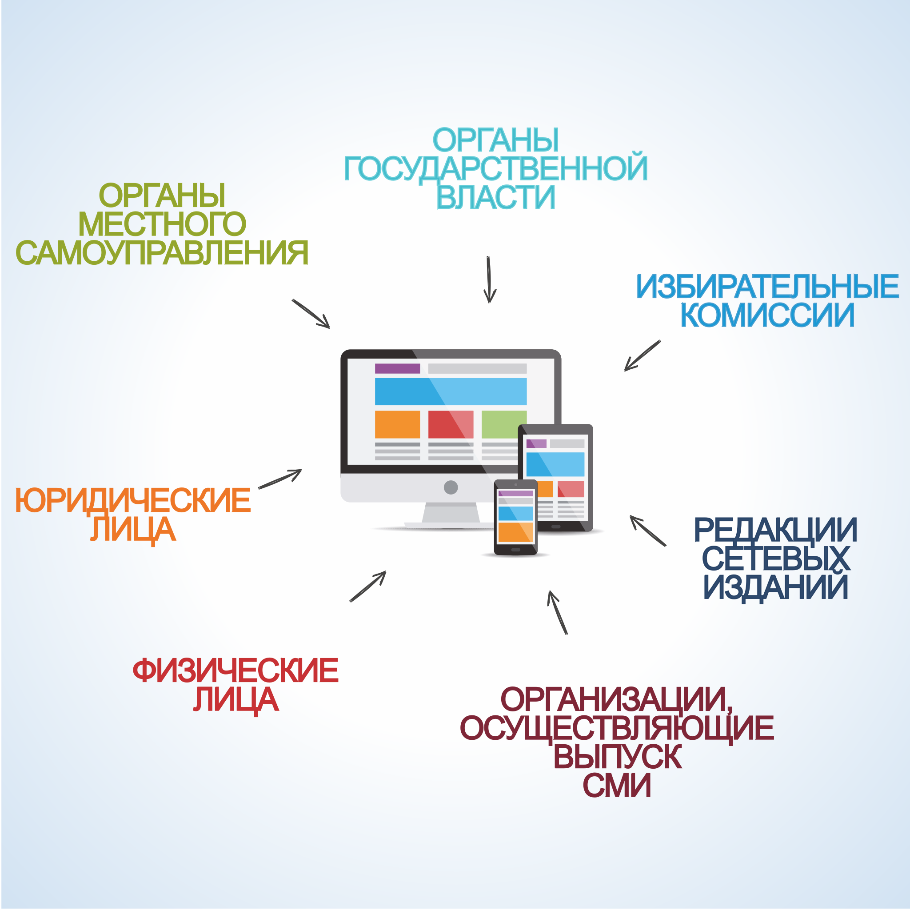

#### Урок 8.1. Информационное обеспечение выборов. Информирование избирателей и предвыборная агитация {#lesson-1.08.1}

Информационное обеспечение выборов включает в себя информирование избирателей и предвыборную агитацию, которые способствуют осознанному волеизъявлению граждан и гласности выборов.

Информирование избирателей представляет собой осуществляемую в период всей избирательной кампании систематическую деятельность по доведению до сведения избирателей объективной и достоверной информации, связанной с выборами и не носящей агитационного характера.

Субъектами избирательного процесса, имеющими право вести работу по информированию избирателей являются: органы государственной власти, органы местного самоуправления, избирательные комиссии, организации, осуществляющие выпуск средств массовой информации, редакции сетевых изданий, физические и юридические лица.

Избирательные комиссии организуют информирование избирателей о ходе подготовки и проведения выборов, сроках и порядке совершения избирательных действий, законодательстве Российской Федерации о выборах и референдумах, кандидатах и избирательных объединениях. Также комиссии принимают необходимые меры по информированию избирателей, являющихся инвалидами.

Органы государственной власти, органы местного самоуправления не вправе информировать избирателей о кандидатах, об избирательных объединениях.

Информирование избирателей осуществляется в течение всей избирательной кампании, началом которой является день официального опубликования решения уполномоченного органа о назначении выборов, окончанием – день представления избирательной комиссией, организующей выборы, отчета о расходовании средств соответствующего бюджета, выделенных на подготовку и проведение выборов.

Деятельность территориальной избирательной комиссии по информированию избирателей, в зависимости от уровня проводимых выборов, включает в себя следующие мероприятия:

- информационно-разъяснительные – доведение до сведения избирателей информации о дате проведения выборов, месте, времени голосования, о кандидатах, избирательных объединениях, принимающих участие в выборах, разъяснение обязательных процедур и действий, совершаемых участниками избирательного процесса и т.д.;
- по осуществлению контроля полноты и своевременности опубликования обязательной информации органами государственной власти, местного самоуправления, зарегистрированными кандидатами, избирательными объединениями, выдвинувшими зарегистрированных кандидатов, зарегистрировавших список кандидатов;
- по взаимодействию с органами местного самоуправления в части информирования избирателей;
- по осуществлению контроля за деятельностью участковых избирательных комиссий по информированию избирателей, проживающих на территории избирательного участка.

Возможны следующие разнообразные объективные формы информирования:

- текстовая форма (письма, листовки, объявления, иные печатные материалы, надписи на перетяжках, билбордах, щитах и т.п.);
- аудиосообщения (сообщения по радио, объявления по системам оповещения, устные сообщения и т.п.);
- визуальные формы (рисунки, графические изображения, незвуковые видеоролики на установленных в общественных местах мониторах и т.п.) и аудиовизуальные формы (трансляция по телевидению, звуковые видеоролики на установленных в общественных местах мониторах и т.п.).

При проведении выборов всех уровней территориальная избирательная комиссия не является комиссией, организующей выборы (за исключением тех случаев, когда на нее возлагаются полномочия окружной комиссии или избирательной комиссии муниципального образования). Информационные материалы для избирателей, как правило, изготавливаются комиссией, организующей выборы, и передаются для размещения и распространения нижестоящим комиссиям.
