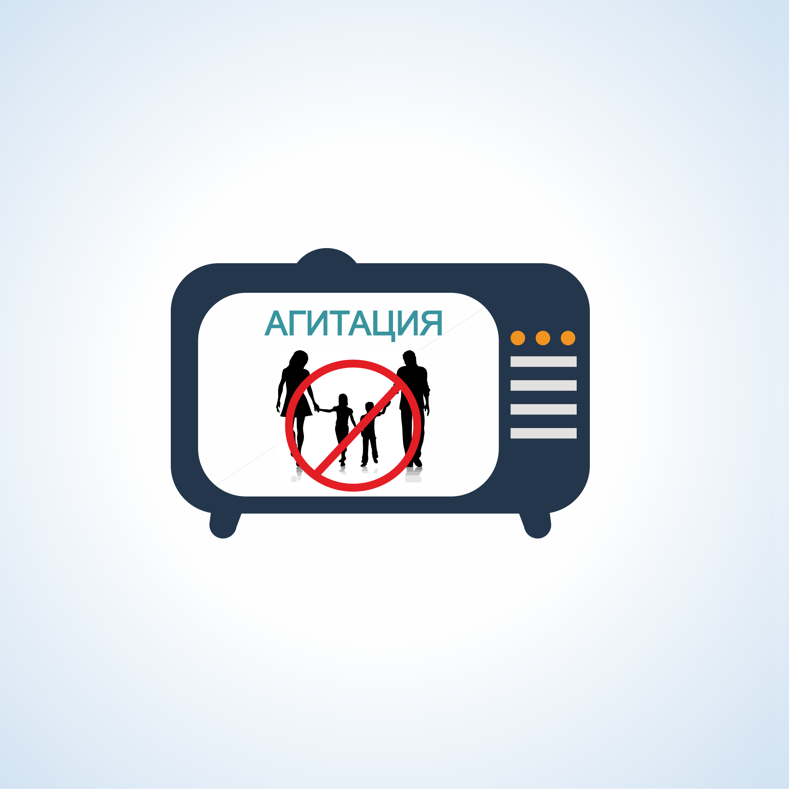

#### Урок 8.3. Предвыборная агитация. Формы предвыборной агитации и сроки проведения {#lesson-1.08.3}

Предвыборная агитация – это деятельность, осуществляемая в период избирательной кампании и имеющая целью побудить или побуждающая избирателей к голосованию за кандидата, список кандидатов или против него (них).

Запрещено проводить предвыборную агитацию и распространять любые агитационные материалы:

- органам государственной власти и органам местного самоуправления;
- лицам, замещающим государственные или выборные муниципальные должности, государственным и муниципальным служащим в рабочее время и/или с использованием служебного положения;
- воинским частям, военным учреждениям и организациям;
- избирательным комиссиям, членам комиссий с правом решающего голоса;
- благотворительным и религиозным организациям, учрежденным ими организациям;
- представителям организаций, осуществляющих выпуск средств массовой информации, и представителям редакций сетевых изданий при осуществлении ими профессиональной деятельности;
- иностранным гражданам, лицам без гражданства, иностранным юридическим лицам;
- международным организациям и международным общественным движениям.

Предвыборная агитация может проводиться на каналах организаций телерадиовещания, в периодических печатных изданиях и сетевых изданиях, посредством проведения агитационных публичных мероприятий, посредством выпуска и распространения печатных, аудиовизуальных и других агитационных материалов, иными не запрещенными законом методами.

В проведении предвыборной агитации на каналах телевидения и радио, в периодических печатных изданиях обязаны принимать участие государственные и муниципальные организации телерадиовещания, редакции государственных и муниципальных периодических печатных изданий, финансируемые из соответствующих бюджетов. Перечень таких СМИ предоставляется в избирательные комиссии, организующие выборы управлением Роскомнадзора по Дальневосточному федеральному округу.

Эфирное время и печатные площади государственных и муниципальных СМИ могут предоставляться кандидатам и избирательным объединениям, как на платной, так и на бесплатной основе.

В проведении агитации также могут принимать участие и иные организации телерадиовещания и редакции периодических печатных изданий, но только на платной основе. Исключение составляют СМИ, принадлежащие избирательным объединениям, выдвинувшим кандидатов на выборах.

Размещение агитационных материалов кандидатов и избирательных объединений в периодических печатных изданиях, в эфире каналов телерадиовещания должно осуществляться в соответствии с договорами на равных условиях для всех кандидатов или избирательных объединений, участвующих в выборах.

Во всех агитационных материалах должна обязательно помещаться информация о том, за счет средств избирательного фонда какого кандидата, избирательного объединения была произведена оплата публикации. Если агитационные материалы были опубликованы безвозмездно, информация об этом должна содержаться в публикации с указанием на то, кто разместил эту публикацию.

Агитационные публичные мероприятия могут проводиться в помещениях, выделенных органами местного самоуправления для встреч с избирателями, иных местах, не запрещенных законом.
Время для проведения агитационных мероприятий в этих помещениях, устанавливает своим решением избирательная комиссия, зарегистрировавшая кандидата либо по её поручению нижестоящая избирательная комиссия.

Кандидаты, избирательные объединения, также вправе арендовать на основе договора здания и помещения, принадлежащие гражданам и организациям независимо от формы собственности для проведения своих агитационных мероприятий, за исключением мест, где это запрещено законом.

Запрещается проведение предвыборной агитации в расположении воинских частей, военных организаций и учреждений. Исключение из этого правила составляют случаи, когда единственное здание или помещение, пригодное для проведения агитационного мероприятия в форме собрания, находится в расположении воинской части, либо в военной организации или учреждении.

Агитационные митинги, шествия, пикеты, организуются и проводятся согласно действующему законодательству.

Все агитационные материалы должны изготавливаться на территории Российской Федерации.

Запрещается изготовление печатных агитационных материалов:

- в организациях и у индивидуальных предпринимателей, не опубликовавших сведения о размере и условиях оплаты работ и услуг по изготовлению печатных агитационных материалов в течение 30 дней со дня официального опубликования решения о назначении выборов; 
- по договору с физическими лицами, не являющимися индивидуальными предпринимателями;
- без предварительной оплаты за счет средств соответствующего избирательного фонда;
- без указания сведений об изготовителе (наименование, юридический адрес и идентификационный номер налогоплательщика, для индивидуальных предпринимателей ФИО лица, полный адрес его проживания, включая субъект РФ), сведений о заказчике, а также информации о тираже и дате выпуска, информации об оплате изготовления из средств избирательного фонда.

Такие места обязаны, не позднее чем за 30 дней до дня голосования, выделить на территории каждого избирательного участка органы местного самоуправления.

Печатные агитационные материалы могут быть бесплатно размещены на объектах, находящихся в государственной или муниципальной собственности, принадлежащих организациям с долей государственного или муниципального участия более 30 процентов.

В помещениях, на зданиях, сооружениях, находящихся в частной собственности, агитационные материалы могут размещаться только с согласия собственника (владельца) и на его условиях.

Печатные предвыборные агитационные материалы запрещено вывешивать (расклеивать, размещать):

- на памятниках, обелисках, зданиях, сооружениях и в помещениях, имеющих историческую, культурную или архитектурную ценность;
- в зданиях, в которых размещены избирательные комиссии, помещения для голосования, и на расстоянии менее 50 метров от входа в них.

В день голосования, печатные агитационные материалы, ранее размещенные на зданиях и сооружениях сохраняются, за исключением зданий, в которых размещены избирательные комиссии, помещения для голосования, и на расстоянии менее 50 метров от входа в них.

Период времени, в течение которого разрешается проводить предвыборную агитацию называется агитационным периодом.

Агитационный период начинается:

- для избирательного объединения - со дня принятия им решения о выдвижении кандидата, кандидатов, списка кандидатов;
- для кандидата, выдвинутого в составе списка кандидатов - со дня представления в соответствующую избирательную комиссию списка кандидатов;
- для кандидата, включенного в заверенный список кандидатов по одномандатным (многомандатным) избирательным округам - со дня представления в избирательную комиссию документов, предусмотренных пунктом 14.3 статьи 35 Федерального закона от 12.06.2002 № 67-ФЗ;
- для кандидата, выдвинутого непосредственно - со дня представления кандидатом в избирательную комиссию заявления о согласии баллотироваться.

Предвыборная агитация на каналах организаций телерадиовещания, в периодических печатных изданиях и в сетевых изданиях проводится в период, который начинается за 28 дней до дня голосования.

Прекращается агитационный период в ноль часов по местному времени дня, предшествующего дню голосования.

В день голосования и в предшествующий ему день, называемый «днём тишины», проведение предвыборной агитации запрещено.
