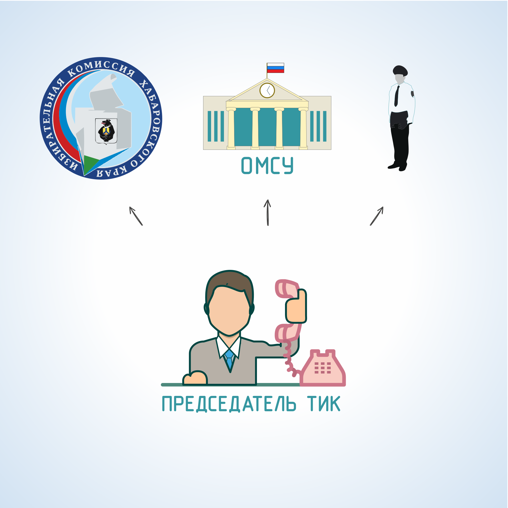

#### Урок 8.4. Осуществление контроля за проведением предвыборной агитации {#lesson-1.08.4}

Территориальные избирательные комиссии осуществляют на территории избирательного округа контроль за соблюдением правил проведения предвыборной агитации и пресечение противоправных действий, которые могут возникнуть при проведении агитации кандидатами и избирательными объединениями. Этот контроль осуществляется избирательной комиссией в течение всего агитационного периода.

Контрольные функции ТИК заключаются в:

- проверке мест размещения, распространения печатных и аудиовизуальных агитационных материалах на соблюдение требований избирательного законодательства;
- проверках соблюдения правил агитации при проведении публичных агитационных мероприятий;
- выявлении нарушений избирательного законодательства, при проведении агитации в периодических печатных изданиях, на каналах телерадиовещания, в сетевых изданиях, с использованием технических каналов связи;
- предупреждении и пресечении правонарушений, связанных с проведением предвыборной агитации, в пределах предоставленных избирательной комиссии полномочий.

Основными формами контрольных действий ТИК являются:

- регулярные объезды территории нижестоящих избирательных участков, на которых проводятся выборы; 
- присутствие членов избирательной комиссии при проведении публичных агитационных мероприятий;
- отслеживание публикаций в периодических печатных изданиях, распространяемых на подведомственной территории в период избирательной кампании;
- отслеживание материалов, выходящих в эфир на каналах телерадиовещания на территории, где проводятся выборы;
- отслеживание публикаций в сетевых изданиях;
- фиксация нарушений правил предвыборной агитации, проводимой на публичных агитационных мероприятиях, в средствах массовой информации и с использованием технических каналов связи.
- принятие решений о мерах воздействия на нарушителей законодательства о выборах;
- информирование о проведенных проверках и выявленных нарушениях.

В случае выявления нарушений избирательного законодательства при проведении предвыборной агитации или получении информации о таких нарушениях, члены ТИК должны, по возможности, принять меры к немедленному их устранению, сообщить о факте нарушения в избирательную комиссию, организующую выборы, правоохранительные органы и органы местного самоуправления той территории, где эти нарушения выявлены.

При поступлении обращений о нарушении требований избирательного законодательства и (или) выявлении факта подобного нарушения, ТИК принимает решение о принятии соответствующих мер в отношении участника избирательного процесса, допустившего это нарушение, в пределах своей компетенции.
