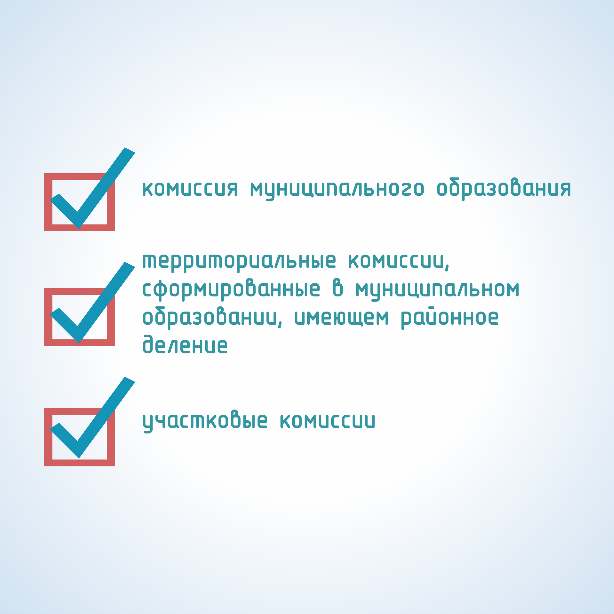

#### Урок 1.2. Система и статус избирательных комиссий при проведении муниципальных выборов {#lesson-2.01.2}

При проведении выборов действует строго определенная система избирательных комиссий, структура которой определяется уровнем и видом выборов – федеральный, региональный и местный (муниципальный).

На выборах депутатов представительного органа муниципального образования комиссия муниципального образования является вышестоящей для всех избирательных комиссий по выборам депутатов представительного органа.
