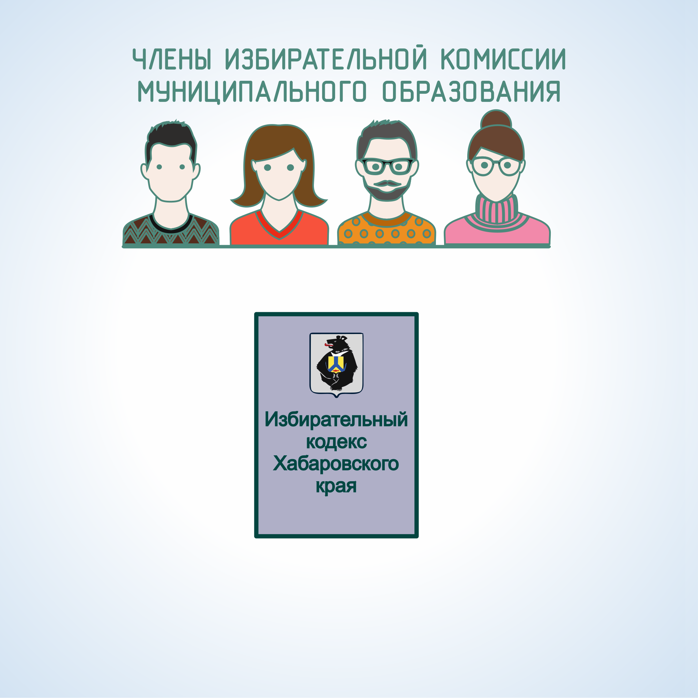

#### Урок 1.3. Полномочия избирательной комиссии муниципального образования {#lesson-2.01.3}

В соответствии со статьей 27 Избирательного кодекса Хабаровского края комиссия муниципального образования:

1) осуществляет на территории муниципального образования контроль за соблюдением избирательных прав граждан Российской Федерации;
2) обеспечивает на территории муниципального образования реализацию мероприятий, связанных с подготовкой и проведением выборов депутатов представительных органов, главы муниципального образования, изданием необходимой печатной продукции;
3) определяет схему образования избирательных округов при выборах депутатов представительного органа муниципального образовании я и представляет ее на утверждение в соответствующий орган местного самоуправления;
4) устанавливает формы бюллетеней на выборах органов местного самоуправления, формы списка избирателей и других избирательных документов, порядок их хранения;
5) утверждает текст бюллетеня на выборах главы муниципального образования, изготавливает их и обеспечивает ими участковые комиссии;
6) проводит проверку подписей избирателей в подписных листах при проведении выборов главы муниципального образования, регистрирует кандидатов на должность главы муниципального образования и их доверенных лиц, выдает им удостоверения;
7) получает от окружных комиссии протоколы о регистрации кандидатов в депутаты представительного органа муниципального образования;
8) осуществляет контроль за поступлением и расходованием средств избирательных фондов кандидатов на должность главы муниципального образования;
9) публикует список зарегистрированных кандидатов на должность главы муниципального образования;
10) публикует в местных периодических печатных изданиях финансовые отчеты кандидатов и сведения о размерах и об источниках образования избирательных фондов кандидатов на должность главы муниципального образования;
11) устанавливает результаты выборов и регистрирует избранного главу муниципального образования, выдает ему удостоверение установленного образца;
12) устанавливает общие результаты выборов депутатов представительного органа муниципального образования;
13) осуществляет на территории муниципального образования меры по обеспечению при проведении выборов в органы местного самоуправления соблюдения единого порядка опубликования итогов голосования и результатов выборов;
14) осуществляет на территории муниципального образования меры по обеспечению при проведении выборов в органы местного самоуправления соблюдения единого порядка распределения эфирного времени и печатной площади между зарегистрированными кандидатами при проведении предвыборной агитации;
15) осуществляет на территории муниципального образования меры по обеспечению при проведении выборов в органы местного самоуправления соблюдения единого порядка установления итогов голосования, определения результатов выборов;
16) осуществляет на территории муниципального образования меры по организации финансирования подготовки и проведения выборов в органы местного самоуправления, распределяет выделенные из местного бюджета  средства на финансовое обеспечение подготовки и проведения выборов в органы местного самоуправления, контролирует целевое использование указанных средств;
17) оказывает правовую, методическую, организационно-техническую помощь нижестоящим комиссиям;
18) заслушивает сообщения органов местного самоуправления по вопросам, связанным  с подготовкой и проведением выборов в органы местного самоуправления;
19) рассматривает жалобы (заявления) на решения и действия (бездействие) нижестоящих комиссий;
20) формирует окружные комиссии по выборам депутатов представительного органа муниципального образования и назначает председателей комиссий;
21) назначает и организует повторные и дополнительные выборы депутатов представительных органов муниципальных образований;
22) осуществляет иные полномочия в соответствии с избирательным законодательством, Уставом края, уставом муниципального образования.
