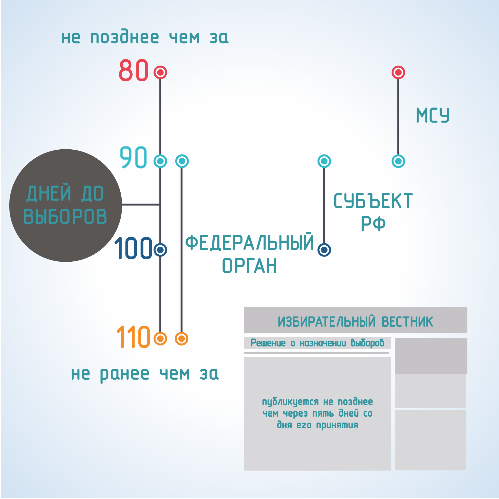
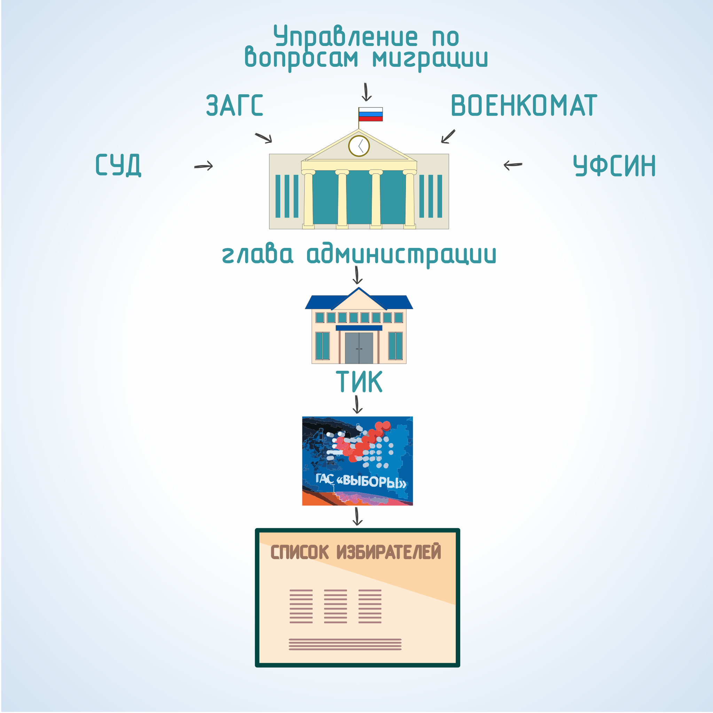
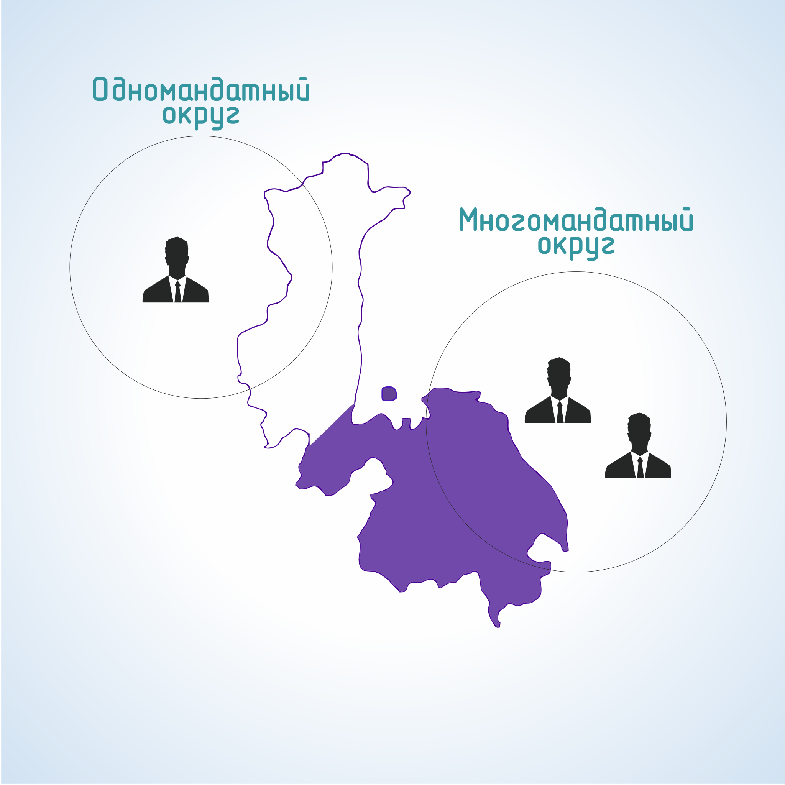
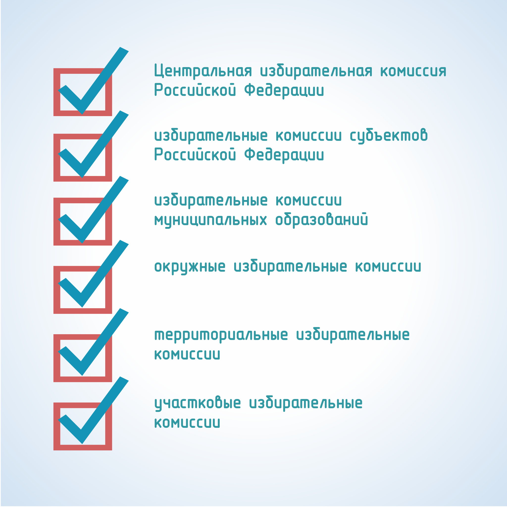

#### Урок 2.1. Избирательный процесс и его стадии {#lesson-2.02.1}

Избирательный процесс в Российской Федерации включает в себя установленную законом совокупность стадий, состоящих из конкретных избирательных процедур и избирательных действий.

Стадии избирательного процесса – это этапы организации и проведения выборов, в рамках которых совершаются предусмотренные законами избирательные действия, а также избирательные процедуры, обеспечивающие реализацию избирательных прав граждан Российской Федерации и иных участников выборов.

В избирательном процессе выделяют следующие стадии:

##### 1. Назначение выборов

Решение о назначении должно быть принято:

- по выборам в федеральный орган государственной власти не ранее чем за 110 дней и не позднее чем за 90 дней до дня голосования;
- по выборам в орган государственной власти субъекта Российской Федерации не ранее чем за 100 дней и не позднее чем за 90 дней до дня голосования;
- по выборам в орган местного самоуправления не ранее чем за 90 дней и не позднее чем за 80 дней до дня голосования. При назначении досрочных выборов сроки, могут быть сокращены, но не более чем на одну треть.

Решение о назначении выборов подлежит официальному опубликованию в средствах массовой информации не позднее чем через пять дней со дня его принятия.

Если уполномоченный орган (должностное лицо) по тем или иным причинам не назначил выборы, они назначаются соответствующей избирательной комиссией, если же и она не смогла это сделать – то соответствующим федеральным судом общей юрисдикции.

##### 2. Регистрация избирателей

Регистрация избирателей, проживающих на территории соответствующего муниципального образования, осуществляется главой местной администрации. Основанием для регистрации избирателей, на территории муниципального образования является факт нахождения места жительства избирателей на соответствующей территории. Указанный факт устанавливается на основании сведений, представляемых органами, осуществляющими регистрацию граждан Российской Федерации по месту пребывания и по месту жительства в пределах Российской Федерации.

Список избирателей составляется территориальной комиссией (комиссией муниципального образования) с использованием ГАС «Выборы» отдельно по каждому избирательному участку.

Соответствующая территориальная комиссия (комиссия муниципального образования) передает по акту участковым избирательным комиссиям первый экземпляр списка избирателей не позднее чем за 10 дней до дня голосования.

##### 3. Образование избирательных округов и избирательных участков

Избирательные округа – это территориальные единицы, от которых избираются депутаты и другие выбираемые лица. В зависимости от числа избираемых лиц избирательные округа могут быть:

- одномандатными (от каждого округа избирается только одно лицо в выборный орган);
- многомандатными (от каждого округа избирается несколько лиц в выборный орган).

Для проведения голосования и подсчета голосов избирателей образуются избирательные участки. Они образуются главой местной администрации по согласованию с соответствующей территориальной комиссией сроком на пять лет из расчета не более чем три тысячи избирателей на каждом участке с учетом местных и иных условий исходя из необходимости создания максимальных удобств для избирателей.

Списки избирательных участков с указанием их границ и адресов участковых избирательных комиссий должны быть опубликованы главой местной администрации муниципального образования в местной печати не позднее, чем за 40 дней до дня выборов.

##### 4. Формирование избирательных комиссий

Порядок формирования избирательных комиссий по выборам в федеральные органы государственной власти, в органы государственной власти субъектов Российской Федерации определяется соответственно федеральными законами, законами и иными нормативными актами законодательных (представительных) органов государственной власти субъектов РФ.

##### 5. Выдвижение и регистрация кандидатов

Кандидаты и политические партии для участия в выборах должны пройти процедуру выдвижения и регистрации.

Граждане РФ, обладающие пассивным избирательным правом, могут быть выдвинуты кандидатами непосредственно либо в составе списка кандидатов в соответствии с законодательством.

Для регистрации кандидата, списка кандидатов не позднее чем за 45 дней до дня голосования до 18 часов по местному времени в соответствующую избирательную комиссию представляется документы, предусмотренные законом.

##### 6. Предвыборная агитация

Представляет собой деятельность граждан и общественных объединений по подготовке и распространению информации, имеющую целью побудить избирателей к участию в голосовании за или против тех или иных кандидатов (списков кандидатов).

Информирование избирателей и предвыборная агитация в совокупности составляют информационное обеспечение выборов, и обеспечивает реализацию принципа гласности выборов. Агитационный период для кандидата, выдвинутого непосредственно, начинается со дня представления кандидатом в избирательную комиссию заявления о согласии баллотироваться. Агитационный период прекращается в ноль часов по местному времени дня, предшествующего дню голосования.

##### 7. Голосование

Одна из основных стадий избирательного процесса. Голосование проходит в один или два тура и осуществляется лично путем подачи избирательного бюллетеня. О времени и месте голосования территориальные и участковые комиссии обязаны оповестить избирателей, участников референдума не позднее чем за 10 дней до дня голосования через средства массовой информации или иным способом, а при проведении досрочного и повторного голосования – в порядке и сроки, которые предусмотрены законодательством, но не позднее чем за пять дней до дня голосования.

##### 8. Подсчет голосов и определение результатов выборов

Подсчет голосов осуществляется непосредственно членами участковой комиссии с правом решающего голоса, открыто и гласно, в присутствии наблюдателей, по его итогам составляется протокол. Определение итогов голосования осуществляется участковыми комиссиями путем составления протоколов об итогах голосования на избирательных участках. 

Итоги голосования, на основании протоколов участковых комиссий, обрабатываются в соответствующих вышестоящих избирательных комиссиях, окончательные результаты выборов определяются соответствующей избирательной комиссией. Официальное опубликование результатов выборов осуществляется в соответствующем официальном печатном издании избирательной комиссией, определяющей результаты выборов.

##### 9. Повторное голосование

Эта стадия избирательного процесса является факультативной и возникает только при наступлении предусмотренных законодательством обстоятельств. Организация и проведение повторного голосования осуществляются в соответствии с законом.
