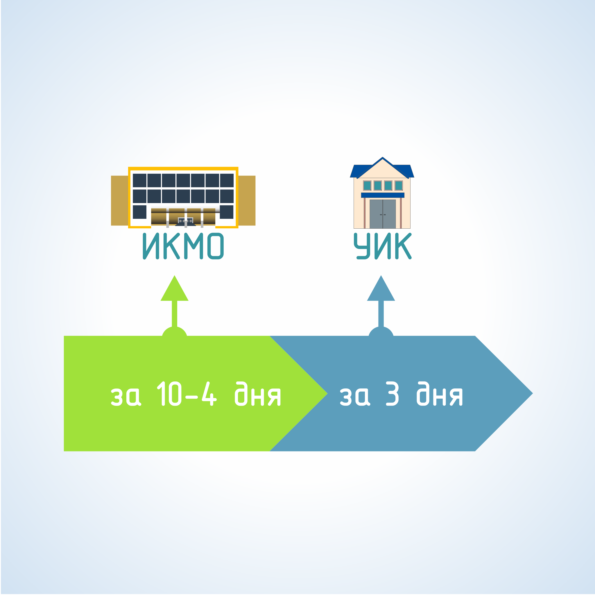

#### Урок 5.1. Сроки проведения досрочного голосования избирателей {#lesson-2.05.1}

При проведении выборов в органы местного самоуправления избиратель вправе проголосовать в помещении комиссии муниципального образования (территориальной комиссии, сформированной в муниципальном образовании, имеющем районное деление) – за 10 - 4 дня до дня голосования, или в участковой комиссии – не ранее чем за 3 дня до дня голосования.

