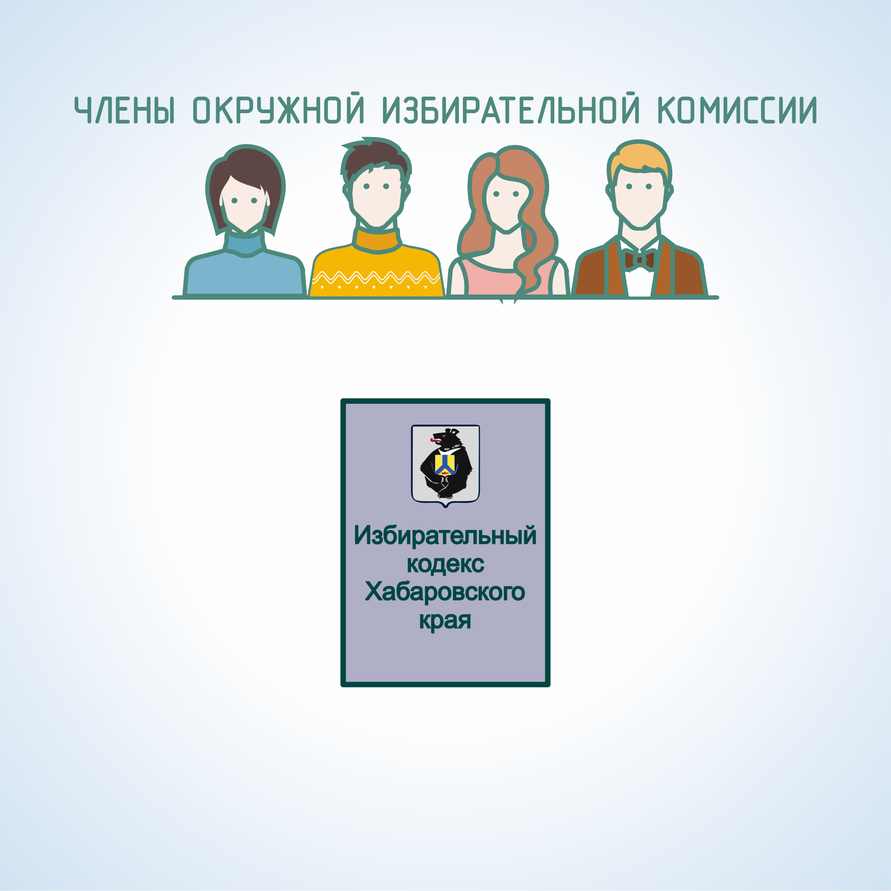

#### Урок 1.2. Полномочия окружной избирательной комиссии {#lesson-3.02.1}

В соответствии со статьей 29 Избирательного кодекса Хабаровского края окружная избирательная комиссия:

1) осуществляет на территории округа контроль за соблюдением избирательных прав граждан Российской Федерации, исполнением федеральных законов о выборах;
2) взаимодействует с органами государственной власти, органами местного самоуправления по вопросам, связанным с подготовкой и проведением выборов в избирательном округе;
3) проводит проверку достоверности подписей избирателей, представленных для регистрации кандидатов;
4) осуществляет регистрацию кандидатов, их доверенных лиц, выдает им удостоверения, публикует сведения о зарегистрированных кандидатах в средствах массовой  информации;
5) обеспечивает контроль за целевым использованием денежных средств, выделенных ей на подготовку и проведение выборов,  а также за поступлением и расходованием средств избирательных фондов кандидатов, обеспечивает периодическое опубликование сведений о формировании и расходовании средств фондов;
6) утверждает текст бюллетеня в избирательном округе на выборах депутата Думы,представительного органа муниципального образования;
7) осуществляет на территории избирательного округа меры по обеспечению единого порядка голосования, подсчета голосов избирателей, установления итогов голосования, определения результатов выборов, а также порядка опубликования итогов и результатов выборов;
8) обеспечивает информирование избирателей о сроках и порядке осуществления избирательных действий, ходе избирательной кампании, кандидатах;
9) определяет результаты выборов по избирательному округу;
10) публикует (обнародует) в соответствующих средствах массовой информации результаты выборов по избирательному округу, выдает удостоверения об избрании зарегистрированному кандидату;
11) оказывает правовую, методическую, организационно-техническую помощь участковым комиссиям;
12) осуществляет руководство деятельностью участковых комиссий, рассматривает жалобы (заявления) на решения и действия (бездействие) участковых комиссий, принимает по указанным жалобам (заявлениям) мотивированные решения;
13) обеспечивает хранение и передачу документов, связанных с подготовкой и проведением выборов, в соответствии с утвержденным избирательной комиссией края порядком, уничтожает избирательные документы по истечении сроков хранения;
14) осуществляет иные полномочия в соответствии с избирательным законодательством.

Срок полномочий окружных избирательных комиссий истекает через два месяца со дня официального опубликования результатов выборов, если в вышестоящую комиссию не поступили жалобы (заявления) на действия (бездействие) данной комиссии, в результате которых был нарушен порядок подсчета голосов, либо если по данным не ведется судебное разбирательство. 

В случае обжалования итогов голосования на территории избирательного округа или результатов выборов полномочия окруженной избирательной комиссии прекращаются со дня, следующего за днем исполнения окружной избирательной комиссией решения вышестоящей комиссии либо исполнения вступившего в законную силу судебного решения.
