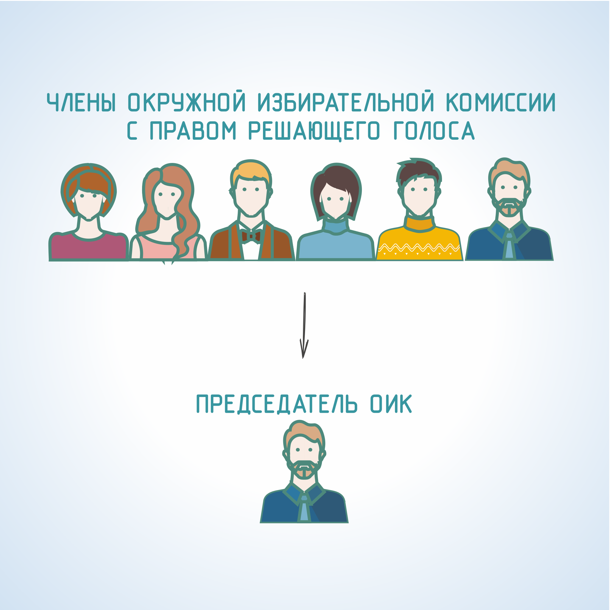

#### Урок 1.4. Организация деятельности окружной избирательной комиссии {#lesson-3.01.4}

Деятельность комиссии осуществляется коллегиально. Окружная избирательная комиссия правомочна приступить к работе, если ее состав сформирован не менее чем на две трети от установленного состава.

Председатель окружной избирательной комиссии назначается на должность из числа членов комиссии с правом решающего голоса и освобождается от должности решением вышестоящей комиссии. Заместитель председателя и секретарь комиссии избираются тайным голосованием на ее первом заседании из числа членов комиссии с правом решающего голоса.

Заседания комиссии созываются председателем или по его поручению заместителем председателя комиссии по мере необходимости.

Член комиссии с правом решающего голоса обязан присутствовать на всех заседаниях комиссии.

Заседание комиссии является правомочным, если на нем присутствует большинство от установленного числа членов комиссии с правом решающего голоса. Решения комиссии принимаются на заседании комиссии большинством голосов от установленного числа членов комиссии с правом решающего голоса.

На заседании комиссии, на котором будет рассматриваться вопрос о регистрации кандидата, вправе присутствовать соответственно выдвинутый кандидат либо его уполномоченный представитель по финансовым вопросам.
