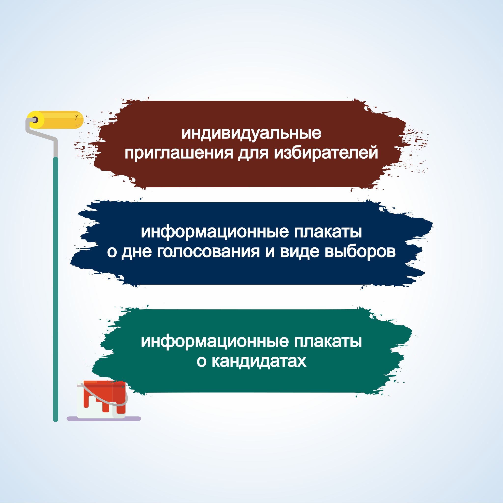

#### Урок 4.1. Информационное обеспечение выборов {#lesson-3.04.1}

Информационное обеспечение выборов включает в себя информирование избирателей и предвыборную агитацию, которые способствуют осознанному волеизъявлению граждан и гласности выборов.

Работу по информированию избирателей имеют право вести: органы государственной власти, органы местного самоуправления, избирательные комиссии, организации, осуществляющие выпуск средств массовой информации, редакции сетевых изданий, физические и юридические лица.

Избирательные комиссии организуют информирование избирателей, в том числе через средства массовой информации, о ходе подготовки и проведения выборов, сроках и порядке совершения избирательных действий, законодательстве Российской Федерации о выборах и референдумах, кандидатах и избирательных объединениях. Комиссии также принимают необходимые меры по информированию избирателей, участников референдума, являющихся инвалидами.

Органы государственной власти, органы местного самоуправления не вправе информировать избирателей о кандидатах и избирательных объединениях.

Информирование избирателей представляет собой осуществляемую в период всей избирательной кампании систематическую деятельность по доведению до сведения избирателей объективной и достоверной информации, связанной с выборами и не носящей агитационного характера. При этом содержание информационных материалов, размещаемых в СМИ или распространяемых иным способом, не должно нарушать принцип равенства кандидатов, избирательных объединений.

Продолжительность периода информирования избирателей определяется длительностью избирательной кампании. 

Избирательная кампания – деятельность по подготовке и проведению выборов, осуществляемая в период со дня официального опубликования (публикации) решения уполномоченного на то должностного лица, государственного органа, органа местного самоуправления о назначении выборов до дня представления избирательной комиссией, организующей выборы, отчета о расходовании средств соответствующего бюджета, выделенных на подготовку и проведение выборов.

В деятельности окружной избирательной комиссии по информированию избирателей, можно выделить следующие мероприятия:

- информационно-разъяснительные – доведение до сведения избирателей информации, как о дате проведения выборов, месте, времени голосования, так и о кандидатах, избирательных объединениях принимающих участие в выборах, разъяснение обязательных процедур и действий, совершаемых участниками избирательного процесса и т.д.;
- по осуществлению контроля полноты и своевременности опубликования зарегистрированными кандидатами, избирательными объединениями, выдвинувшими зарегистрированных кандидатов, зарегистрировавших список кандидатов; 
- по взаимодействию с органами местного самоуправления в части информирования избирателей на территории избирательного округа;
- по осуществлению контроля за деятельностью нижестоящих избирательных комиссий по информированию избирателей.

Возможны разнообразные объективные формы информирования, такие как:

- текстовая форма (письма, листовки, объявления, иные печатные материалы, надписи на перетяжках, билбордах, щитах и т.п.); 
- аудио-сообщения (сообщения по радио, объявления по системам оповещения, устные сообщения и т.п.);
- визуальные формы (рисунки, графические изображения, незвуковые видеоролики на установленных в общественных местах мониторах и т.п.);
- аудиовизуальные формы (трансляция по телевидению, звуковые видеоролики на установленных в общественных местах мониторах и т.п.).

