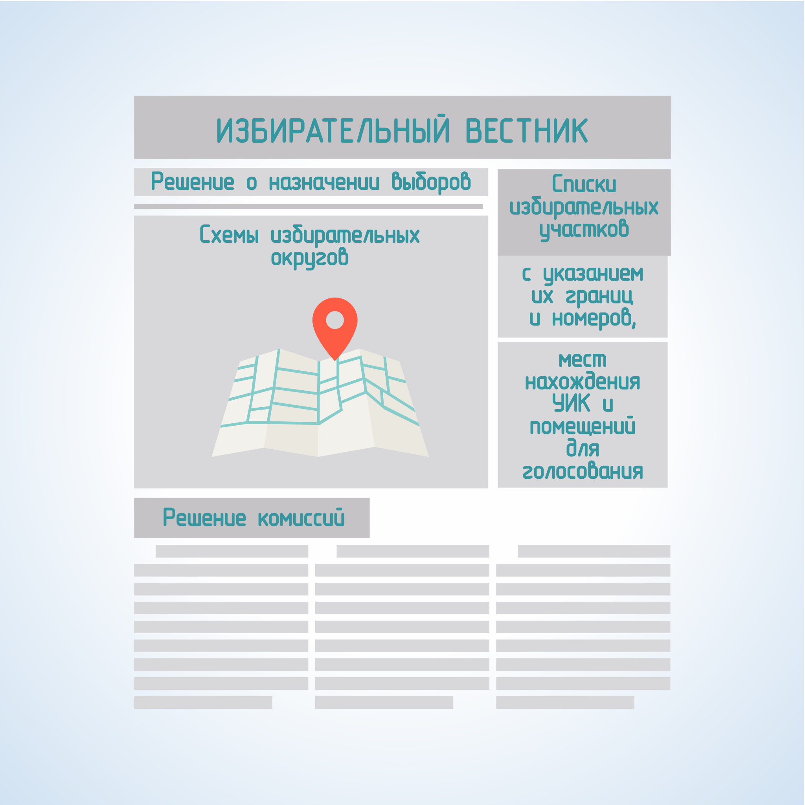

#### Урок 4.3. Взаимодействие окружных избирательных комиссий со средствами массовой информации при информировании избирателей в период проведения выборов {#lesson-3.04.3}

При планировании мероприятий по информированию избирателей во взаимодействии со СМИ, в зависимости от субъектов информирования выделяют два вида информирования: официальное (в том числе и доведение информации до субъектов избирательного процесса) и неофициальное.

Официальное информирование осуществляется органами государственной власти и местного самоуправления, избирательными комиссиями.

Основными способами подачи официальной информации являются: опубликование (обнародование) в установленные сроки определенной информации, доведение до сведения избирателей информации в СМИ, размещение соответствующих материалов в сети Интернет.

В частности, Федеральный закон от 12.06.2002 № 67-ФЗ указывает следующую обязательную для опубликования информацию: схемы избирательных округов, включая ее графическое изображение; списки избирательных участков с указанием их границ и номеров, мест нахождения участковых комиссий и помещений для голосования; решения комиссий, непосредственно связанные с подготовкой и проведением выборов.

Возможно осуществление официального информирования другими субъектами избирательного процесса, когда это является условием их участия в избирательном процессе.

Доведение информации до сведения избирателей, как способ информирования отличается от опубликования тем, что субъект информирования (чаще всего это избирательная комиссия) сам определяет форму такого информирования. Так, предупреждение, вынесенное соответствующей комиссией кандидату, избирательному объединению, доводится до сведения избирателей через СМИ либо иным способом, сведения о кандидатах, представленные при их выдвижении, доводятся до сведения избирателей в объеме, установленном организующей выборы избирательной комиссией и т.д.

К способам официального информирования можно отнести и размещение участковой комиссией информации обо всех кандидатах, списках кандидатов, избирательных объединениях, внесенных в бюллетень, на информационных стендах в помещении для голосования либо непосредственно перед ним.

Официальная информация размещается в первую очередь в СМИ, которые являются официальными публикаторами. Если таковых нет, информация публикуется в государственных и муниципальных СМИ. Так, государственные и муниципальные организации, осуществляющие теле- и (или) радиовещание, и редакции государственных и муниципальных периодических печатных изданий обязаны безвозмездно предоставлять комиссиям эфирное время для информирования избирателей и печатную площадь для опубликования решений комиссий и размещения иной информации.

Задачей ОИК в случае официального информирования является с одной стороны – контроль сроков и полноты сведений, публикуемых (размещаемых) субъектами избирательного процесса, с другой стороны – обеспечение опубликования официальной информации в пределах своей компетенции.

Неофициальное информирование – освещение избирательной кампании организациями, осуществляющими выпуск СМИ, опубликование (обнародование) результатов общественного мнения, связанных с выборами, а также предоставление пользователю (потребителю) информации по запросу. При неофициальном информировании материал готовится непосредственно журналистами, которые должны руководствоваться принципами объективности, достоверности, равенства кандидатов и избирательных объединений.

Задачей ОИК в случае неофициального информирования является контроль соблюдения организациями, осуществляющими выпуск СМИ принципов информирования избирателей.

В рамках обеспечения информирования избирателей, ОИК необходимо организовать:

- изготовление в установленные сроки информационных материалов, их своевременное и полное распространение, используя ресурсы, как избирательных комиссий, так и органов местного самоуправления;
- проведение информационных встреч представителей комиссии с различными категориями избирателей;
- взаимодействие со СМИ;
- осуществление контроля процесса информирования избирателей всеми субъектами избирательного процесса.
