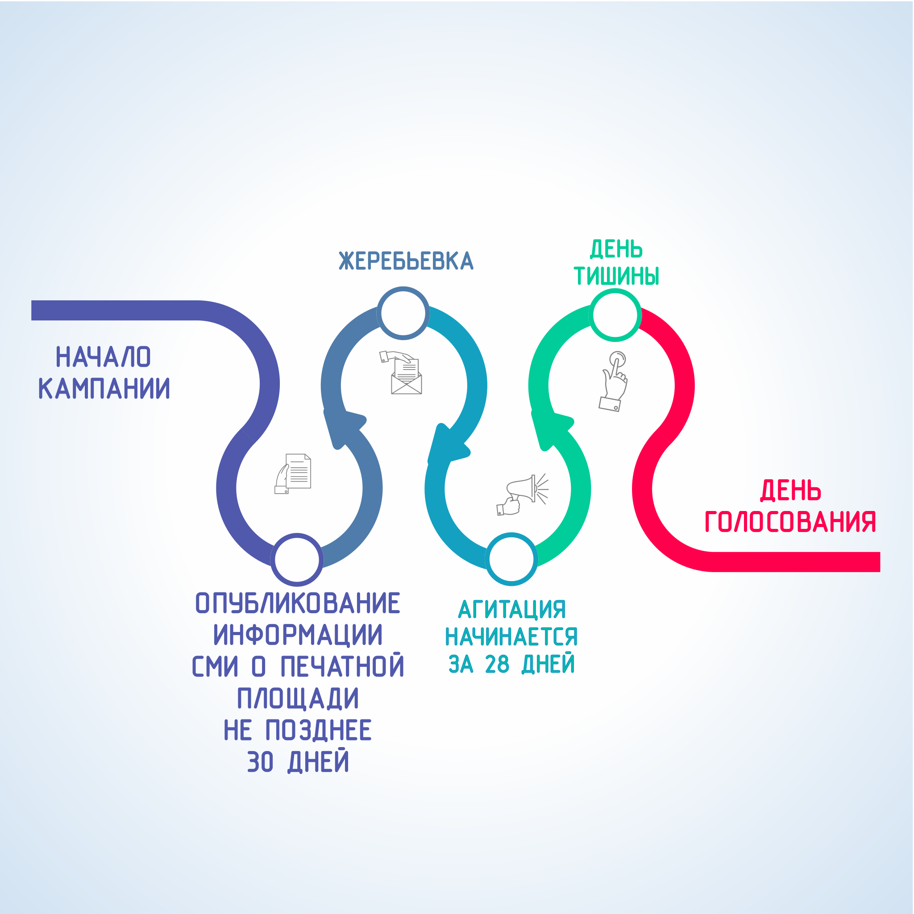

#### Урок 4.4. Предвыборная агитация на каналах организаций телерадиовещания и в периодических изданиях {#lesson-3.04.4}

Предвыборная агитация может проводится на каналах организаций телерадиовещания и в периодических печатных изданиях. Проводится она в период, который начинается за 28 дней до дня голосования и прекращается в ноль часов по местному времени в день, предшествующий дню голосования.

В проведении предвыборной агитации на каналах телевидения и радио, в периодических печатных изданиях обязаны принимать участие государственные и муниципальные организации телерадиовещания, редакции государственных и муниципальных периодических печатных изданий, финансируемые из соответствующего бюджета. Перечень государственных и муниципальных СМИ предоставляется в избирательную комиссию, организующую выборы, управлением Роскомнадзора по Дальневосточному федеральному округу.

Эфирное время на каналах организаций телерадиовещания и печатная площадь в периодических печатных изданиях могут предоставляться как на платной, так и на бесплатной основе. 

Государственные и муниципальные СМИ обязаны обеспечить равные условия зарегистрированным кандидатам. С целью обеспечения таких условий, избирательная комиссия, организующая выборы, проводит между всеми зарегистрированными кандидатами жеребьевку по распределению дат и времени выхода в эфир бесплатных предвыборных агитационных материалов и жеребьевку по распределению бесплатной печатной площади в периодических печатных изданиях.

Государственные, муниципальные и негосударственные СМИ, финансируемые из других бюджетов или источников, тоже вправе размещать и публиковать предвыборные агитационные материалы, но только за плату. Для этого они также проводят жеребьевку по распределению платного эфирного времени, платной печатной площади между зарегистрированными кандидатами. 

Информация об объемах бесплатной и платной печатной площади, предоставляемой периодическими печатными изданиями должна быть опубликована в соответствующем издании не позднее чем через 30 дней после дня официального опубликования решения о назначении выборов.

Во всех агитационных материалах, размещаемых в периодических печатных изданиях, должна обязательно помещаться информация о том, за счет средств избирательного фонда какого кандидата, избирательного объединения была произведена оплата публикации. Если агитационные материалы были опубликованы бесплатно или безвозмездно, информация об этом должна содержаться в публикации с указанием на то, кто разместил эту публикацию.
