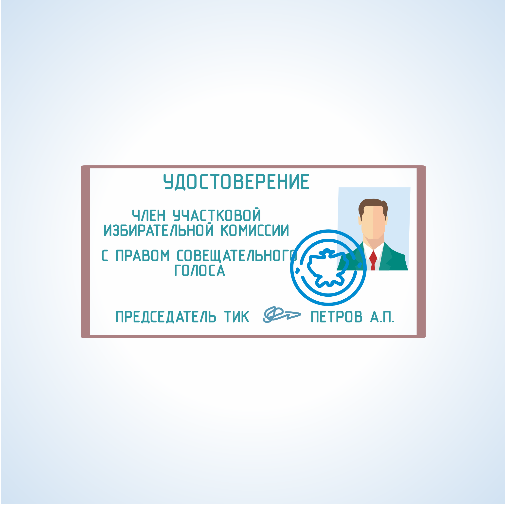

#### Урок 1.4. Статус членов участковой избирательной комиссии с правом совещательного голоса {#lesson-4.1.4}

Члены комиссии с правом совещательного голоса назначаются в состав участковой избирательной комиссии кандидатом, а также избирательным объединением, выдвинувшим список кандидатов.

Назначая члена избирательной комиссии с правом совещательного голоса, зарегистрированный кандидат, избирательное объединение, выдвинувшее зарегистрированного кандидата (список кандидатов), направляет в избирательную комиссию заявление о назначении гражданина членом данной комиссии, сообщая о нем фамилию, имя, отчество, год рождения, место работы или род занятий, полный адрес места жительства.

Членом участковой комиссии с правом совещательного голоса может быть назначен дееспособный гражданин Российской Федерации, достигший 18-летнего возраста.

Член комиссии с правом совещательного голоса обладает равными правами с членом комиссии с правом решающего голоса по вопросам подготовки и проведения выборов, за исключением права:

1) выдавать и подписывать бюллетени, открепительные удостоверения;
2) участвовать в сортировке, подсчете и погашении бюллетеней;
3) составлять протокол об итогах голосования, о результатах выборов;
4) участвовать в голосовании при принятии решения по вопросу, отнесенному к компетенции соответствующей комиссии, и подписывать решения комиссии;
5) составлять протоколы об административных правонарушениях.

Это не может служить основанием для отказа члену комиссии с правом совещательного голоса присутствовать при совершении указанных действий.

Деятельность члена участковой комиссии с правом совещательного голоса не подлежит оплате за счет средств, выделенных избирательной комиссии.

Полномочия членов участковых комиссий с правом совещательного голоса прекращаются в день окончания соответствующей избирательной кампании.

Полномочия члена участковой избирательной комиссии с правом совещательного голоса могут быть прекращены по решению лица или органа, назначивших данного члена комиссии, и переданы другому лицу.
