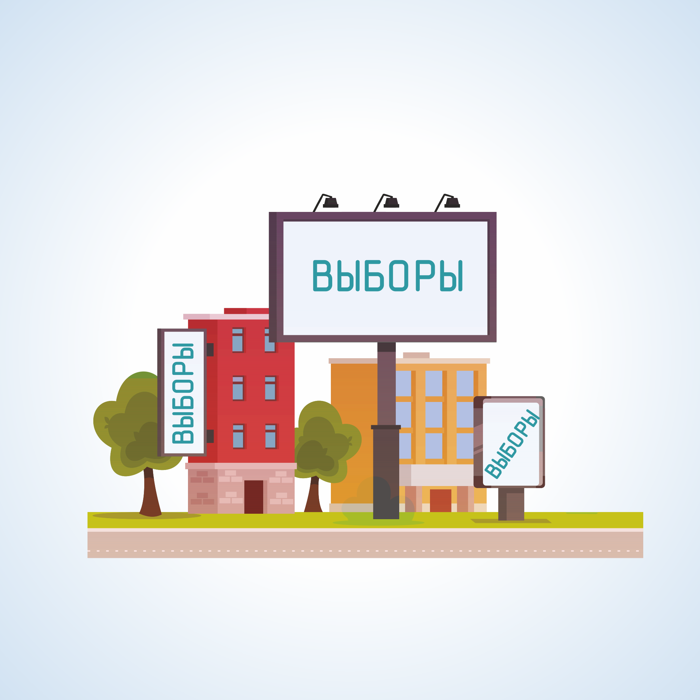
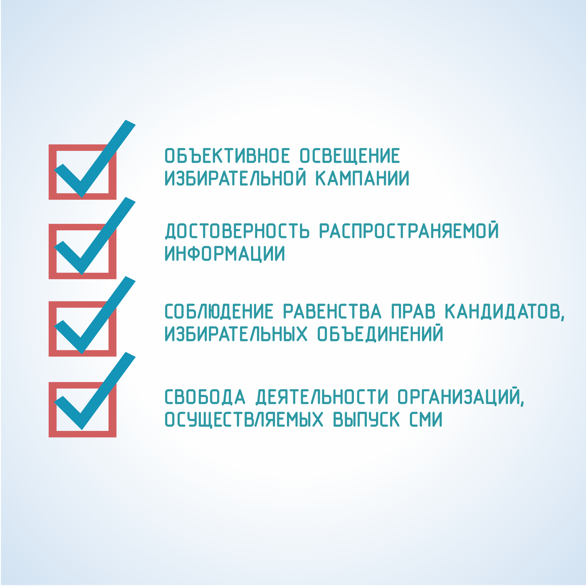

#### Урок 4.1. Правовая основа, цели, сроки информирования {#lesson-4.04.1}

Информационное обеспечение выборов включает в себя информирование избирателей и предвыборную агитацию, которые способствуют осознанному волеизъявлению граждан и гласности выборов.

Субъектами избирательного процесса, имеющими право вести работу по информированию избирателей являются: органы государственной власти, органы местного самоуправления, избирательные комиссии, организации, осуществляющие выпуск средств массовой информации, редакции сетевых изданий, физические и юридические лица.

Объектом информирования являются избиратели, которые должны получить необходимую информацию для того, чтобы осознанно принять участие в выборах.

Избирательные комиссии организуют информирование избирателей, в том числе через средства массовой информации, о ходе подготовки и проведения выборов, о сроках и порядке совершения избирательных действий, о законодательстве Российской Федерации о выборах и референдумах, о кандидатах, об избирательных объединениях. Комиссии также принимают необходимые меры по информированию избирателей, участников референдума, являющихся инвалидами.

Органы государственной власти, органы местного самоуправления не вправе информировать избирателей о кандидатах, об избирательных объединениях.

Информирование избирателей представляет собой осуществляемую в период всей избирательной кампании систематическую деятельность по доведению до сведения избирателей объективной и достоверной информации, связанной с выборами и не носящей агитационного характера. При этом содержание информационных материалов, размещаемых в СМИ или распространяемых иным способом, не должно нарушать принцип равенства кандидатов, избирательных объединений.

Продолжительность периода информирования избирателей определяется длительностью избирательной кампании.

Избирательная кампания – деятельность по подготовке и проведению выборов, осуществляемая в период со дня официального опубликования (публикации) решения уполномоченного на то должностного лица, государственного органа, органа местного самоуправления о назначении выборов до дня представления избирательной комиссией, организующей выборы, отчета о расходовании средств соответствующего бюджета, выделенных на подготовку и проведение выборов.
