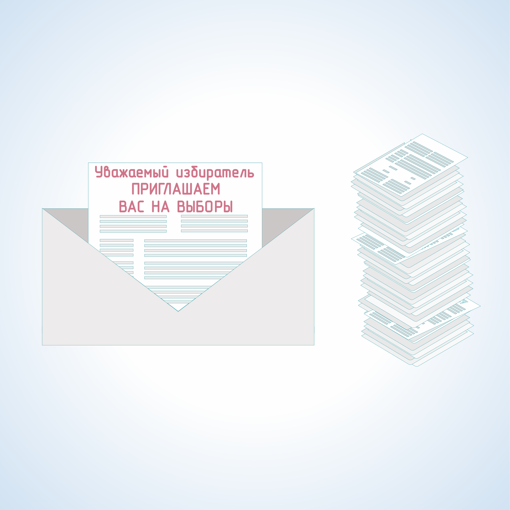

#### Урок 4.2. Организация работы участковой избирательной комиссии по информированию избирателей. Формы информирования избирателей {#lesson-4.04.2}

Возможны разнообразные объективные формы информирования:

- текстовая форма (письма, листовки, объявления, иные печатные материалы, надписи на перетяжках, билбордах, щитах и т.п.),
- аудио-сообщения (сообщения по радио, объявления по системам оповещения, устные сообщения и т.п.),
- визуальные формы (рисунки, графические изображения, незвуковые видеоролики на установленных в общественных местах мониторах и т.п.),
- аудиовизуальные формы (трансляция по телевидению, звуковые видеоролики на установленных в общественных местах мониторах и т.п.).

Участковые избирательные комиссии ведут работу по информированию избирателей на территории избирательного участка, используя в основном текстовые и визуальные формы.

Вопрос обеспечения УИК соответствующими информационными материалами решается вышестоящими избирательными комиссиями (комиссиями организующими выборы).

УИК необходимо организовать своевременное и полное распространение информационных материалов:

- о проводимой на территории избирательного участка выборной кампании;
- о дате, времени и месте голосования на выборах, а также, при необходимости, о возможных схемах проезда к месту голосования;

- о зарегистрированных кандидатах и избирательных объединениях, сведения о которых включены в избирательные бюллетени;
- о сроках и порядке проведения избирательных действий.

К методам распространения печатных информационных материалов относятся:

- размещение информационных плакатов, приглашений в общественных зданиях, учреждениях, организациях расположенных на территории избирательного участка, на постоянных и временных конструкциях, местах размещения агитационных материалов, определенных администрацией муниципального образования и т.д.;
- рассылка и разноска индивидуальных приглашений для избирателей. Данные индивидуальные приглашения изготавливаются вышестоящими избирательными комиссиями (комиссиями организующими выборы) и должны содержать информацию об адресе помещения УИК, времени ее работы, адресе помещения для голосования, информацию о дате, времени, месте голосования, с указанием телефонов избирательных комиссий и т.д.

Дополнительно могут изготавливаться приглашения избирателям, для ознакомления и уточнения сведений об них, содержащихся в списке избирателей на соответствующем избирательном участке.
