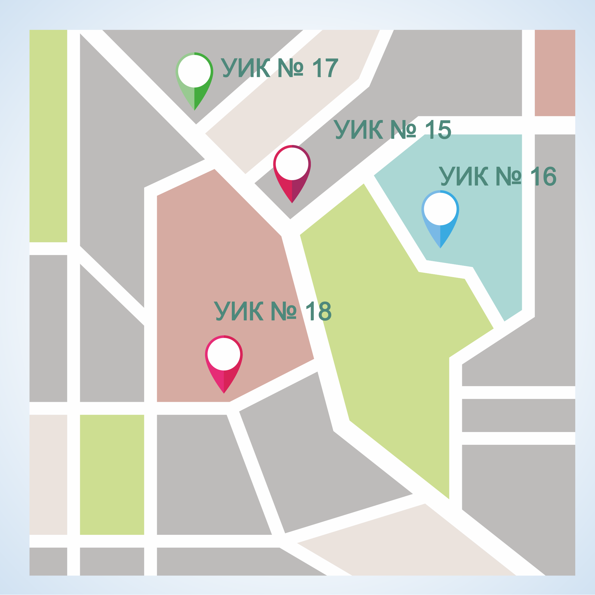

#### Урок 4.4. Участие органов местного самоуправления в информировании избирателей {#lesson-4.04.4}

Законодательно на органы местного самоуправления возлагаются две обязанности, связанные с информированием избирателей.

Первая обязанность связана с опубликованием главой муниципального образования списка избирательных участков, с указанием их границ (если избирательный участок, образован на части территории населенного пункта) либо перечня населенных пунктов (если избирательный участок образован на территориях одного или нескольких населенных пунктов), номеров, мест нахождения участковых комиссий и помещений для голосования. Такая информация должна быть опубликована не позднее, чем за 40 дней до дня голосования.

Вторая обязанность органов местного самоуправления по информированию избирателей, связана с созданием условий для размещения зарегистрированными кандидатами, избирательными объединениями печатных агитационных материалов. Для решения этой задачи органы местного самоуправления по предложению соответствующей комиссии не позднее чем за 30 дней до дня голосования обязаны выделить специальные места для размещения печатных агитационных материалов на территории каждого избирательного участка.

Такие места должны быть удобны для посещения избирателями, и располагаться таким образом, чтобы избиратели, могли ознакомиться с размещенной там информацией. Площадь выделенных мест должна быть достаточной для размещения на них информационных материалов комиссий и агитационных материалов зарегистрированных кандидатов, избирательных объединений. Зарегистрированным кандидатам, избирательным объединениям, должна быть выделена равная площадь для размещения печатных агитационных материалов.

Информация о границах избирательных участков, о специальных местах для размещения печатных агитационных материалов должна находиться в каждой УИК и в дальнейшем необходима для организации плановой работы по информированию избирателей.
