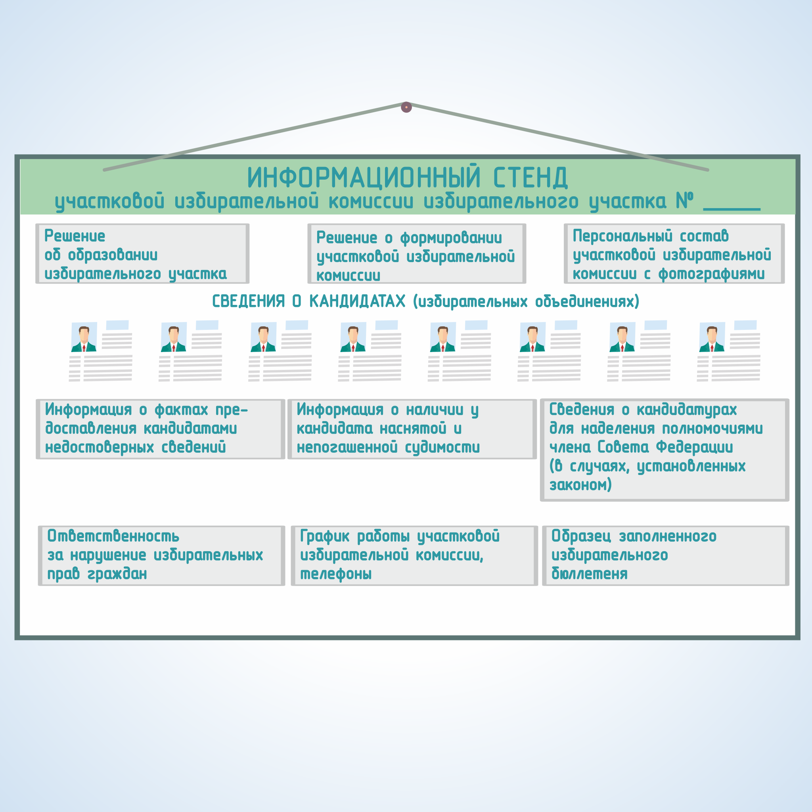
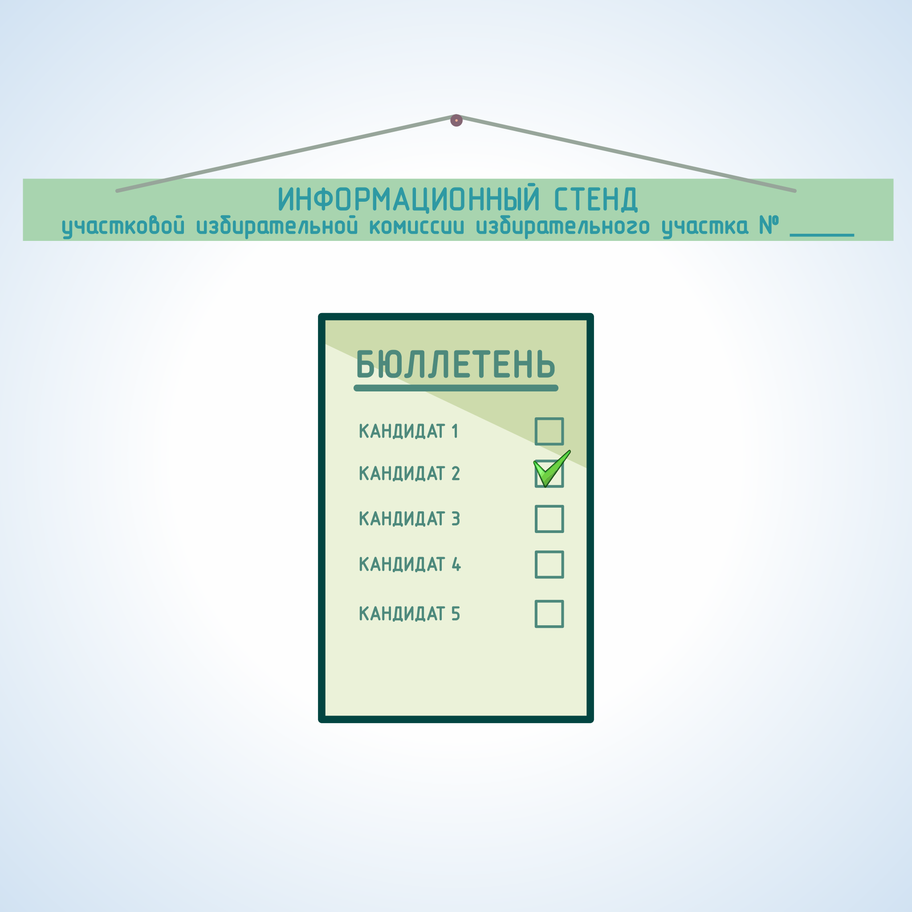
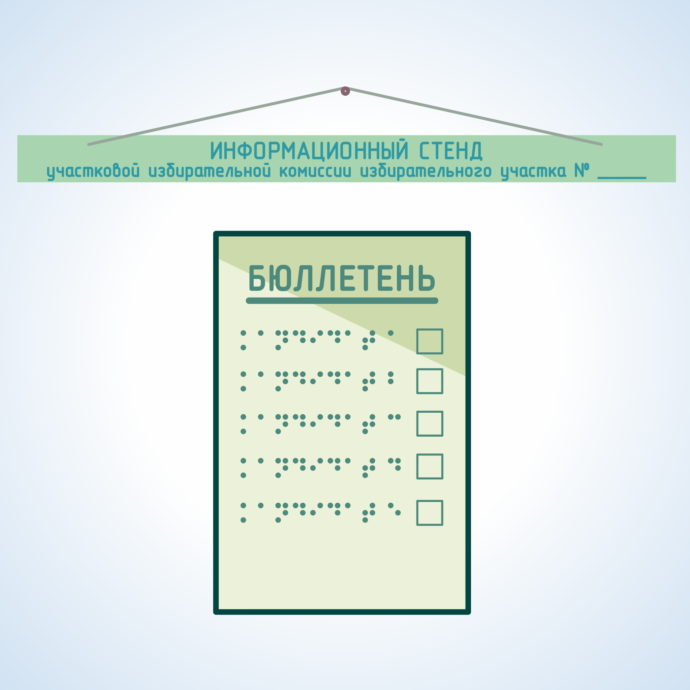
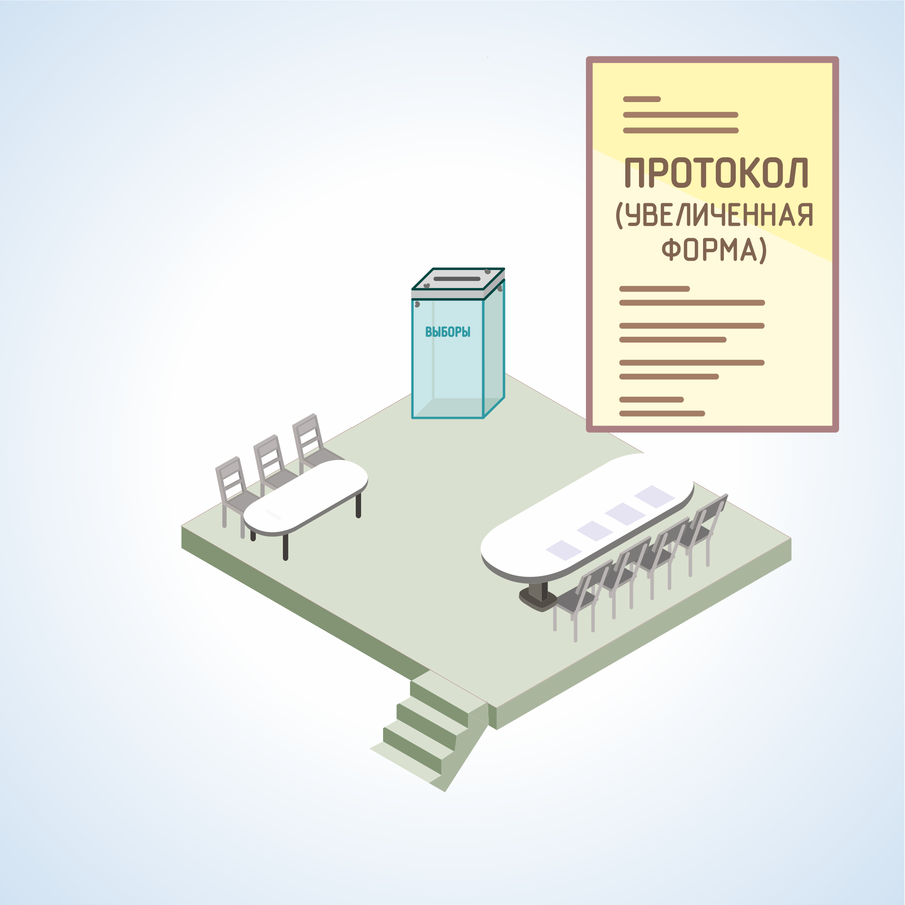

#### Урок 4.3. Информационные материалы, размещаемые в помещении для голосования. Требования к содержанию информационных материалов, размещаемых на избирательном участке {#lesson-4.4.3}

Отдельной формой информирования является оборудование информационного стенда (стендов) в помещении для голосования либо непосредственно перед этим помещением, на котором (которых) в соответствии с законодательством и системой выборов УИК размещает необходимую информацию для избирателей.

УИК размещает следующую информацию обо всех кандидатах, списках кандидатов, избирательных объединениях внесенных в избирательный бюллетень:

1) биографические данные кандидатов в объеме, установленном избирательной комиссией, организующей выборы, но не меньшем чем объем биографических данных, внесенных в избирательный бюллетень; 
2) если кандидат выдвинут политической партией, должно быть написано «выдвинут политической партией» с указанием наименования соответствующей политической партии; 
3) если кандидат сам выдвинул свою кандидатуру, пишут слово «самовыдвижение»; 
4) сведения о доходах и об имуществе кандидатов в объеме, установленном комиссией, организующей выборы; 
5) информацию о фактах недостоверности представленных кандидатами сведений (если такая информация имеется).

В случае наличия у кого-либо из зарегистрированных кандидатов неснятой и непогашенной судимости в информационных материалах должны указываться сведения о судимости кандидата.

На информационном стенде также размещается образец заполненного избирательного бюллетеня, который не должен содержать фамилии зарегистрированных кандидатов, наименования избирательных объединений, участвующих в данных выборах, в котором должны быть приведены варианты заполнения бюллетеня (бюллетеней).

Этот образец рекомендуется размещать и в кабинах (специально оборудованных местах или комнатах) для тайного голосования.

Размещаемые на информационном стенде материалы не должны содержать признаки предвыборной агитации.

На информационном стенде размещаются извлечения из Уголовного кодекса Российской Федерации, законодательства Российской Федерации об административных правонарушениях, касающиеся ответственности за нарушение законодательства Российской Федерации о выборах.

Для информирования избирателей, являющихся инвалидами по зрению, на информационном стенде могут быть размещены материалы, выполненные крупным шрифтом и (или) с применением рельефноточечного шрифта Брайля. Избирательные участки, на информационных стендах которых размещаются такие материалы, определяются решением избирательной комиссии субъекта Российской Федерации.

Все указанные материалы, а также решение об образовании избирательного участка или газета со списками избирательных участков с указанием их номеров и описанием границ, решение ТИК о формировании состава УИК и назначении ее председателя, состав УИК должны быть размещены таким образом, чтобы избиратели свободно могли прочитать их.

В помещении для голосования должна находиться увеличенная форма протокола об итогах голосования, предназначенная для занесения в нее данных об итогах голосования по мере их установления. Увеличенная форма протокола об итогах голосования вывешивается до начала голосования.

На здании, в котором располагается помещение для голосования, должна находиться вывеска с указанием номера избирательного участка. На входе в помещение УИК должна находиться вывеска с указанием часов работы, при этом такую же вывеску следует разместить и на входе в здание, в котором расположено помещение УИК. При входе в здание, где размещается помещение для голосования, может использоваться государственная символика – Государственный флаг Российской Федерации, Государственный герб Российской Федерации.

В здании на пути следования к помещению для голосования размещаются стрелки-указатели.

Если в здании расположены помещения для голосования нескольких избирательных участков, то на вывеске указываются номера всех этих участков, а также помещается объявление с указанием наименования улиц и номеров домов, входящих в границы каждого избирательного участка.

В случае если голосование осуществляется с применением комплексов обработки избирательных бюллетеней (КОИБ) или комплексов электронного голосования (КЭГ), на избирательном участке должны быть размещены плакаты с информацией о порядке голосования с использованием этих технических средств.

Если на избирательном участке ведется видеонаблюдение, при входе на избирательный участок должна быть размещена информация в виде плаката или таблички с текстом: «Внимание! Ведется видеонаблюдение».
