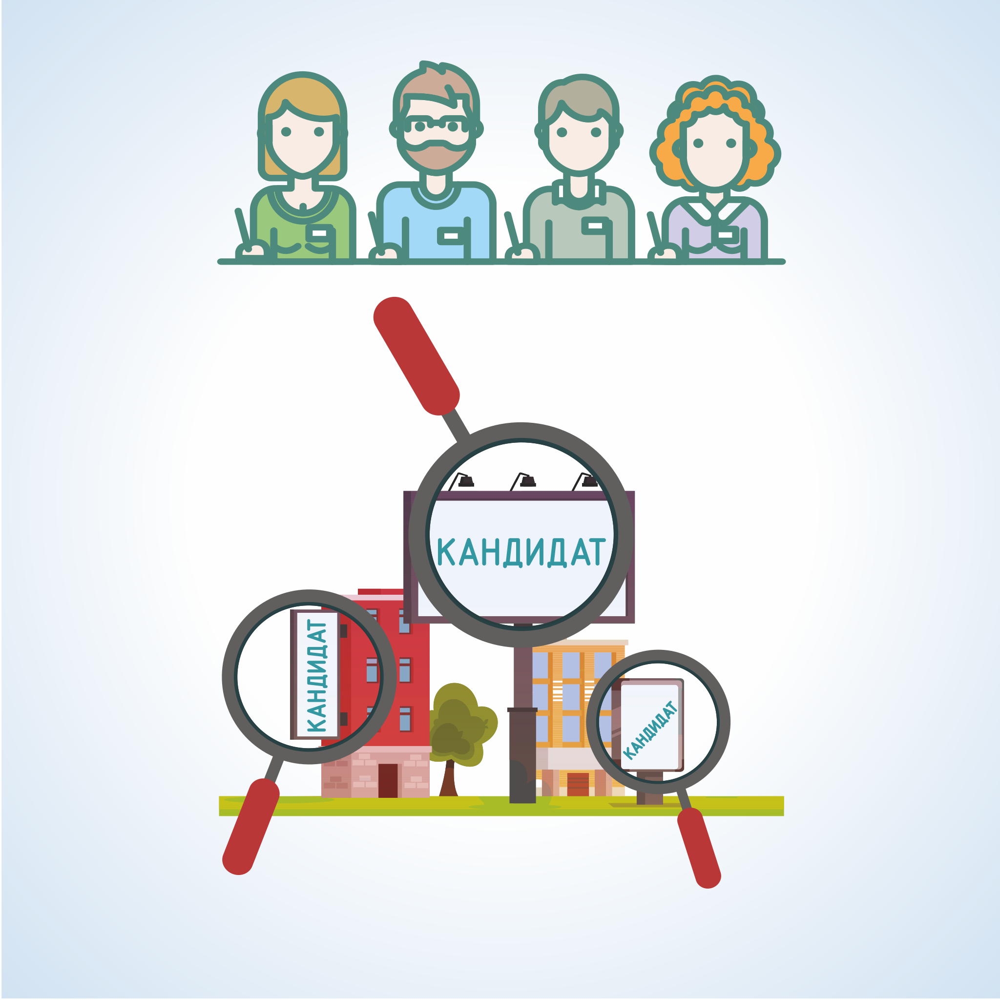
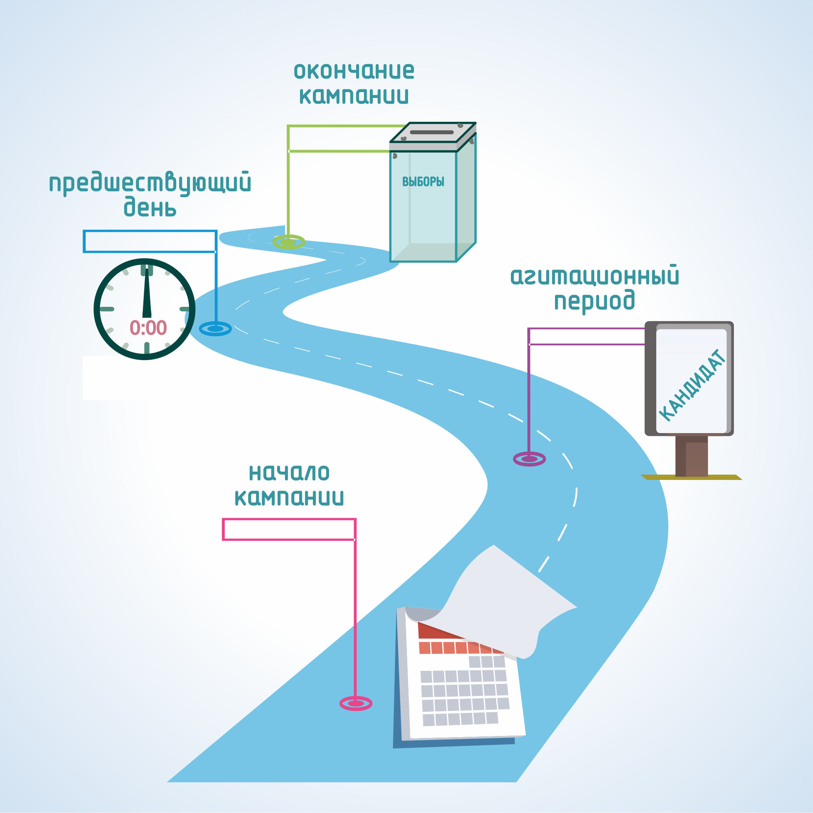

#### Урок 5.1. Предвыборная агитация. Агитационный период, день тишины {#lesson-4.05.1}

В полномочия участковой избирательной комиссии входит осуществление контроля за соблюдением на территории избирательного участка порядка проведения предвыборной агитации и пресечение противоправных действий при проведении агитационных мероприятий.

Предвыборная агитация – это деятельность, осуществляемая в период избирательной кампании и имеющая целью побудить или побуждающая избирателей к голосованию за кандидата, список кандидатов или против него (них).

Предвыборная агитация может проводиться:

- на каналах организаций телерадиовещания, в периодических печатных изданиях и сетевых изданиях;
- посредством проведения агитационных публичных мероприятий;
- посредством выпуска и распространения печатных, аудиовизуальных и других агитационных материалов;
- иными не запрещенными законом методами.

Период времени, в течение которого разрешается проводить предвыборную агитацию, называется агитационным периодом.

Агитационный период начинается:

- для избирательного объединения - со дня принятия им решения о выдвижении кандидата, кандидатов, списка кандидатов;
- для кандидата, выдвинутого в составе списка кандидатов - со дня представления в соответствующую избирательную комиссию списка кандидатов;
- для кандидата, включенного в заверенный список кандидатов по одномандатным (многомандатным) избирательным округам - со дня представления в избирательную комиссию документов, предусмотренных пунктом 14.3 статьи 35 Федерального закона от 12 июня 2002 года № 67-ФЗ;
- для кандидата, выдвинутого непосредственно - со дня представления кандидатом в избирательную комиссию заявления о согласии баллотироваться.

Предвыборная агитация на каналах организаций телерадиовещания, в периодических печатных изданиях и в сетевых изданиях проводится в период, который начинается за 28 дней до дня голосования.

Запрещено проводить предвыборную агитацию и распространять любые агитационные материалы:

- органам государственной власти и органам местного самоуправления;
- лицам, замещающим государственные или выборные муниципальные должности, государственным и муниципальным служащим в рабочее время и/или с использованием служебного положения;
- воинским частям, военным учреждениям и организациям;
- благотворительным и религиозным организациям, учрежденным ими организациям;
- избирательным комиссиям, членам комиссий с правом решающего голоса;
- иностранным гражданам, лицам без гражданства, иностранным юридическим лицам.

Запрещается привлекать к предвыборной агитации лиц, не достигших на день голосования возраста 18 лет, в том числе использовать изображения и высказывания таких лиц в агитационных материалах.

Прекращается агитационный период в ноль часов по местному времени дня, предшествующего дню голосования. В день голосования и в предшествующий ему день, так называемый «день тишины», проведение предвыборной агитации запрещено.

При этом могут сохраняться на прежних местах агитационные печатные материалы (листовки, плакаты и другие материалы), ранее изготовленные и размещенные в установленном порядке на рекламных конструкциях и других стабильно размещенных объектах, где это не запрещено.

