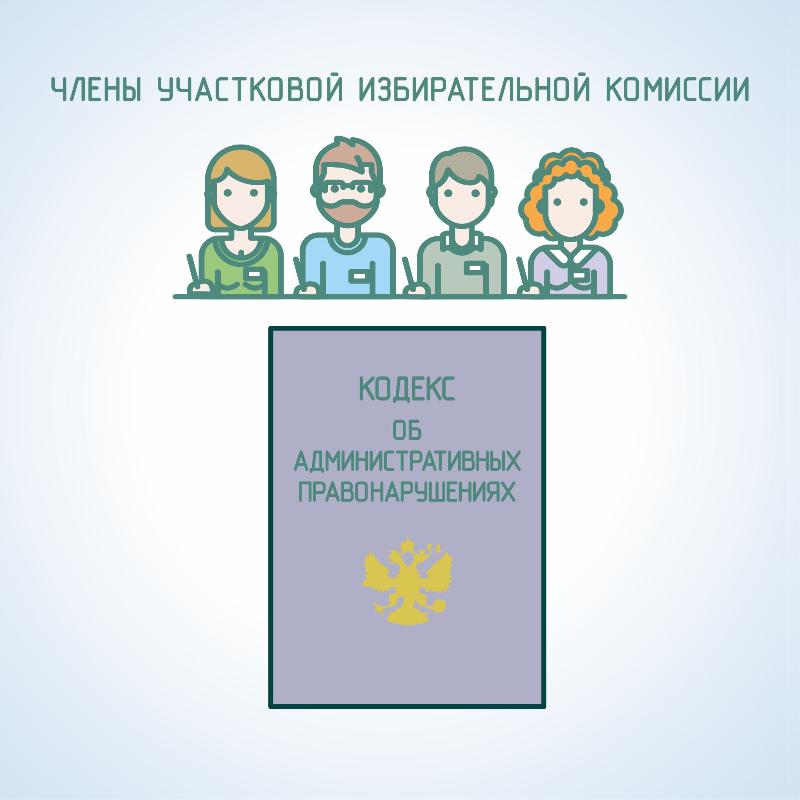

#### Урок 5.3. Ответственность за нарушение законодательства о выборах при ведении агитации {#lesson-4.05.3}

Кодексом об административных правонарушениях Российской Федерации (КоАП РФ) предусмотрена ответственность за следующие нарушения при ведении агитационной деятельности в ходе избирательной кампании, которые возможны на территориях избирательных участков:

- нарушение предусмотренных законодательством о выборах и референдумах порядка и условий проведения предвыборной агитации, на каналах организаций, осуществляющих теле- и (или) радиовещание, и в периодических изданиях (ст. 5.8 КоАП РФ);
- проведение предвыборной агитации вне агитационного периода и в местах, где её проведение запрещено законодательством о выборах (ст. 5.10 КоАП РФ);
- проведение предвыборной агитации лицами, которым участие в её проведении запрещено федеральным законом (ст. 5.11 КоАП РФ);
- изготовление, распространение или размещение агитационных материалов с нарушением требований законодательства о выборах (ст. 5.12 КоАП РФ);
- умышленное уничтожение или повреждение агитационного материала, относящихся к выборам и референдуму (ст. 5.14 КоАП РФ). Однако, в случае, если собственник определенного объекта (здания, ограждения и т.п.) уничтожит размещенный без его согласия на этом объекте агитационный материал, он не будет подлежать ответственности, установленной в указанной статье КоАП РФ;
- подкуп избирателей, либо осуществление в период избирательной кампании благотворительной деятельности с нарушением законодательства о выборах (ст. 5.16 КоАП РФ).

Протоколы об административных правонарушениях, указанных в статьях 5.8, 5.10, 5.12 КоАП РФ, вправе составлять как члены участковых избирательных комиссий с правом решающего голоса, уполномоченные на это соответствующими комиссиями, так и представители органов внутренних дел (полиции). При выявлении нарушений, указанных в статьях 5.11, 5.14 и 5.16 КоАП РФ, члены избирательных комиссий не имеют права на составление протоколов о правонарушении.
