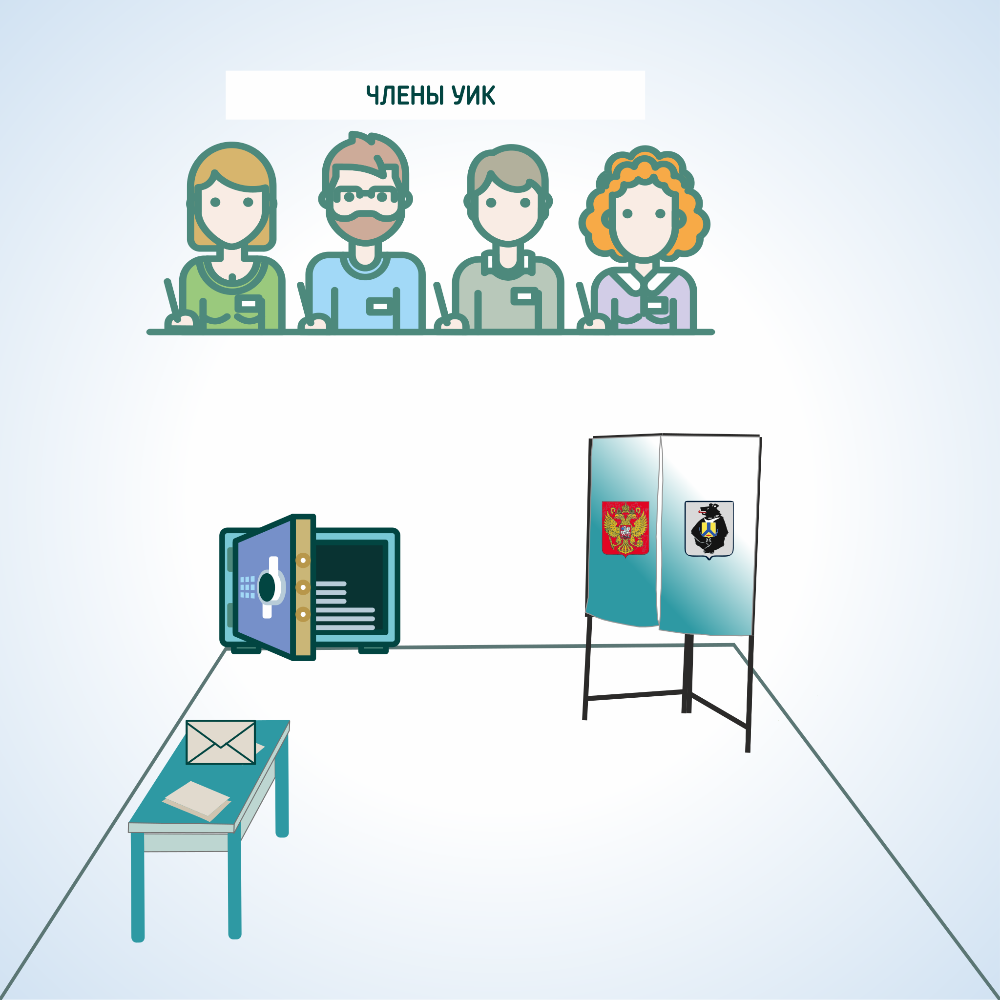

#### Урок 7.2. Требования к помещениям для организации досрочного голосования избирателей {#lesson-4.07.2}

В помещении, в котором осуществляется досрочное голосование, должен быть зал, в котором размещаются кабины или иные специально оборудованные места для тайного голосования, оснащенные системой освещения и снабженные письменными принадлежностями, за исключением карандашей.

 
Участковой комиссии необходимо обеспечить наличие иного оборудования, необходимого для проведения голосования: столы письменные, стулья, сейф или металлический шкаф, печать участковой комиссии, телефон, первичные средства пожаротушения, приборы аварийного освещения (аккумуляторные или карманные фонари).

Кроме того, необходимо иметь достаточное количество непрозрачных конвертов, канцелярский клей.

Оборудование помещений для досрочного голосования должно предусматривать возможность присутствия при проведении досрочного голосования всех членов участковой комиссии, наблюдателей, иных лиц, указанных в части 3 статьи 36 Избирательного кодекса Хабаровского края (члены вышестоящих комиссий и работники их аппаратов, зарегистрированный кандидат, его уполномоченный представитель по финансовым вопросам или доверенное лицо, уполномоченный представитель или доверенное лицо избирательного объединения, список кандидатов которого зарегистрирован вышестоящей комиссией, кандидат из указанного списка, аккредитованные представители средств массовой информации).

Технологическое и иное оборудование необходимо размещать в помещении таким образом, чтобы места для выдачи бюллетеней для голосования, кабины для тайного голосования и места для помещения бюллетеней в непрозрачный конверт и опечатывания, одновременно находились в поле зрения членов участковой комиссии, а также лиц, присутствующих в помещении для голосования. 

Место выдачи бюллетеней должно быть достаточным для свободного размещения списка избирателей, избирательных бюллетеней. Участковой комиссии необходимо обозначить указателями места для наблюдателей, определить место для фото- и видеосъемки.

Перед входом в помещение каждой участковой комиссии должно размещаться объявление о дате, времени и месте проведения досрочного голосования, а также краткая справочная информация с указанием уважительных причин, при наличии которых избиратель вправе проголосовать досрочно.

Участковой комиссии необходимо оборудовать в помещении для голосования либо непосредственно перед этим помещением информационный стенд, где размещается информация о зарегистрированных кандидатах, избирательных объединениях.

В помещении для голосования размещается символика Российской Федерации и Хабаровского края, флаг, герб.

На здании устанавливается вывеска с указанием номера избирательного участка. Если в здании расположены помещения для голосования нескольких избирательных участков, то оборудуются отдельные вывески по каждому участку с указанием номера участка, а также помещается объявление с указанием наименования улиц и номеров домов, входящих в границы каждого избирательного участка. В здании на пути следования к помещению для голосования размещаются стрелки-указатели.

При оборудовании помещения для голосования должны обеспечиваться предусмотренные законодательством Российской Федерации условия для беспрепятственного доступа к данному помещению избирателей, являющихся инвалидами, и голосования в нем. При проведении голосования осуществляется оказание помощи таким лицам в целях реализации ими активного избирательного права.
