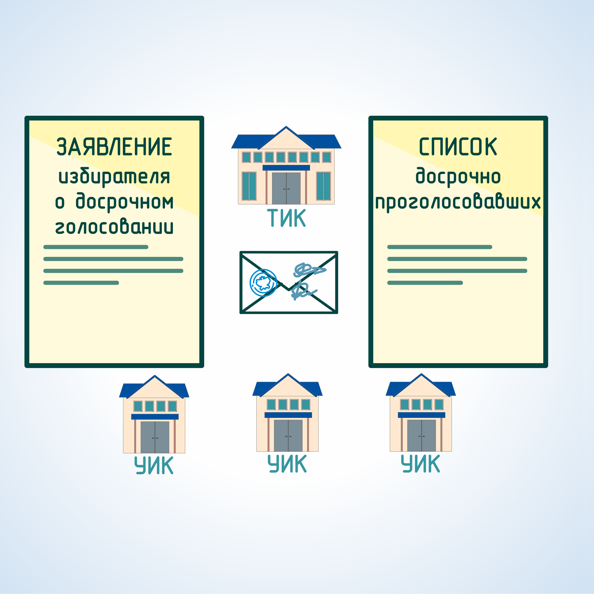
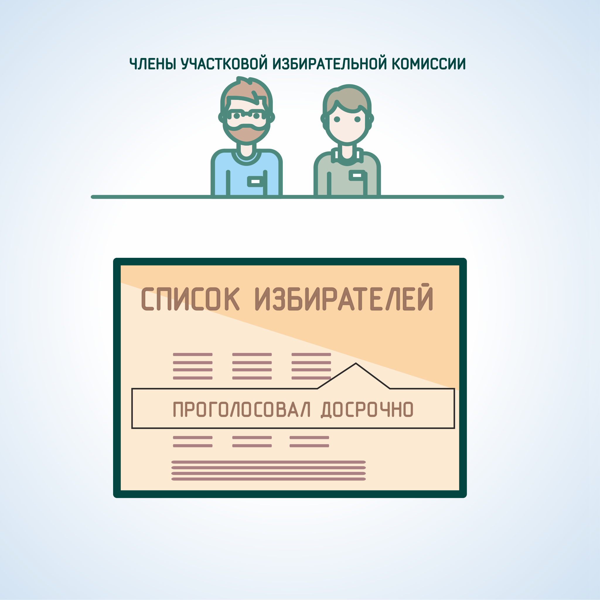

#### Урок 7.3. Порядок проведения досрочного голосования {#lesson-4.07.3}

При проведении выборов в органы местного самоуправления Хабаровского края избирателю, который в день голосования по уважительной причине будет отсутствовать по месту своего жительства и не сможет прибыть в помещение для голосования на избирательном участке, на котором он включен в список избирателей, должна быть предоставлена возможность проголосовать досрочно путем заполнения бюллетеня в помещении участковой комиссии.

К уважительным причинам относятся:

1. Отпуск;
2. Командировка;
3. Режим трудовой и учебной деятельности;
4. Выполнение государственных и общественных обязанностей;
5. Состояние здоровья;
6. Иные уважительные причины.

Члены участковой комиссии не наделены полномочиями по проверке достоверности указанных избирателем причин невозможности прибыть в день голосования в помещение для голосования.

По окончании времени досрочного голосования в избирательной комиссии муниципального образования (территориальной избирательной комиссии) каждая участковая комиссия должна будет получить:

1. соответствующий список досрочно проголосовавших избирателей,
2. приобщенные к списку досрочно проголосовавших заявления избирателей о досрочном голосовании, 
3. конверты с бюллетенями досрочно проголосовавших избирателей.

При получении документов участковая комиссия обязана проверить список избирателей, проголосовавших досрочно, число запечатанных конвертов с избирательными бюллетенями и число заявлений избирателей с указанием причины досрочного голосования, переданных участковой комиссии.

Непосредственно после получения списка досрочно проголосовавших избирателей член участковой комиссии в списке избирателей напротив фамилий избирателей, проголосовавших досрочно в помещении избирательной комиссии муниципального образования (территориальной избирательной комиссии), делает отметку: «Проголосовал досрочно», проставляет дату и время досрочного голосования. Список досрочно проголосовавших избирателей с приобщенными к нему заявлениями избирателей о досрочном голосовании приобщается к списку избирателей.

В случае, если в список досрочно проголосовавших избирателей включен избиратель, который зарегистрировался на территории избирательного участка после составления списков избирателей, то член участковой комиссии вносит сведения о таком избирателе в список и напротив его фамилии делает отметку «Проголосовал досрочно».

Участковая комиссия до начала досрочного голосования принимает решение, в котором определяет график дежурства не менее двух членов избирательной комиссии с правом решающего голоса, в каждый из дней проведения досрочного голосования в помещении участковой комиссии.

Проводить досрочное голосование вправе только члены участковой комиссии с правом решающего голоса.

Организация досрочного голосования должна обеспечивать тайну голосования, исключить возможность искажения волеизъявления избирателя, обеспечивать сохранность бюллетеней и учет голоса избирателя при установлении итогов голосования.

Для проведения досрочного голосования используются бюллетени с подписями членов участковой комиссии с правом решающего голоса.

При проведении досрочного голосования в участковой комиссии все необходимые сведения и отметки вносятся в список избирателей.

Проведение досрочного голосования в участковой комиссии осуществляется в присутствии не менее двух членов участковой комиссии с правом решающего голоса.

Алгоритм проведения досрочного голосования:

##### 1.	Попросить избирателя предъявить паспорт, установить его личность, проверить регистрацию (голосовать имеют право только избиратели, имеющие постоянную регистрацию на территории избирательного округа), удостовериться в том, что данный избиратель не проголосовал досрочно ранее.

##### 2.	Избиратель заполняет заявление по образцу, в котором указывает фамилию, имя и отчество избирателя, адрес места жительства и причину досрочного голосования.

##### 3.	Член избирательной комиссии сверяет данные, указанные в заявлении с данными паспорта избирателя, в том числе отметкой об адресе места жительства. Сверяет причину, указанную избирателем в заявлении, с установленными в законе. Если причина, указанная избирателем в заявлении, не соответствует, необходимо рассмотреть заявление на заседании комиссии и принять по нему решение о признании уважительной.

##### 4.	Найти избирателя в списке, если нет в основном списке – внести в дополнительный лист списка.

##### 5.	При получении избирательного бюллетеня избиратель собственноручно или, с его согласия, член комиссии с правом решающего голоса проставляет в списке избирателей серию и номер паспорта избирателя или документа, заменяющего паспорт гражданина. Избиратель проверяет правильность произведенной записи и расписывается в соответствующих графах списка.

Избиратель, не имеющий возможности самостоятельно расписаться в получении бюллетеня или заполнить бюллетень, вправе воспользоваться для этого помощью другого избирателя, не являющегося членом комиссии, зарегистрированным кандидатом, уполномоченным представителем избирательного объединения, доверенным лицом кандидата, избирательного объединения, наблюдателем. В таком случае избиратель устно извещает членов комиссии о своем намерении воспользоваться помощью для заполнения бюллетеня. При этом в соответствующей (соответствующих) графе (графах) списка избирателей указываются фамилия, имя, отчество, серия и номер паспорта или документа, заменяющего паспорт, лица, оказывающего помощь избирателю.

##### 6.	Далее в соответствующей графе списка расписывается член комиссии с правом решающего голоса, делает надпись в графах, начиная с 6 и далее: «Проголосовал досрочно, дата и время голосования, подпись члена участковой комиссии». После чего выдает избирателю избирательный бюллетень (с двумя подписями членов участковой комиссии и печатью участковой комиссии). При выдаче бюллетеня член комиссии инструктирует избирателя, что он должен после заполнения сложить бюллетени так, чтобы сохранить тайну голосования. 

##### 7.	Член избирательной комиссии проставляет в заявлении избирателя дату и время досрочного голосования этого избирателя, расписывается.

##### 8.	Избиратель проходит в кабину для тайного голосования, заполняет избирательный бюллетень и складывает его так, чтобы не было видно содержание заполненного бюллетеня. 

Если избиратель считает, что при заполнении бюллетеня совершил ошибку, он вправе обратиться к члену комиссии, выдавшему бюллетень, с просьбой выдать ему новый бюллетень взамен испорченного. Член комиссии выдает избирателю новый бюллетень, делает соответствующую отметку в списке избирателей против фамилии данного избирателя и расписывается. Избиратель расписывается в получении нового избирательного бюллетеня. 
Испорченный бюллетень, на котором член комиссии с правом решающего голоса делает соответствующую запись и заверяет ее своей подписью, заверяется также подписью секретаря комиссии, после чего такой бюллетень незамедлительно погашается, о чем составляется акт.

##### 9.	Член избирательной комиссии предоставляет избирателю специальный непрозрачный конверт.

##### 10.	Избиратель вкладывает вне места для тайного голосования бюллетень (бюллетени) в конверт, который сам заклеивает. 

##### 11.	На месте склейки ставятся подписи двух членов участковой комиссии (по желанию расписаться могут члены комиссии с правом совещательного голоса, наблюдатели). Подписи заверяются печатью участковой комиссии. Кроме этого, на заклеенном конверте указывается наименование избирательной кампании, проставляется номер избирательного участка, в списки избирателей которого включен данный избиратель, количество бюллетеней, содержащихся в конверте (данная информация может подготовлена заблаговременно в виде наклейки на конверт).

##### 12.	Запечатанный конверт с бюллетенями, а также заявление избирателя, список избирателей хранятся в сейфе участковой комиссии до дня голосования.

##### 13.	Сведения о количестве избирателей, проголосовавших досрочно необходимо ежедневно передавать по телефону в вышестоящую избирательную комиссию.
