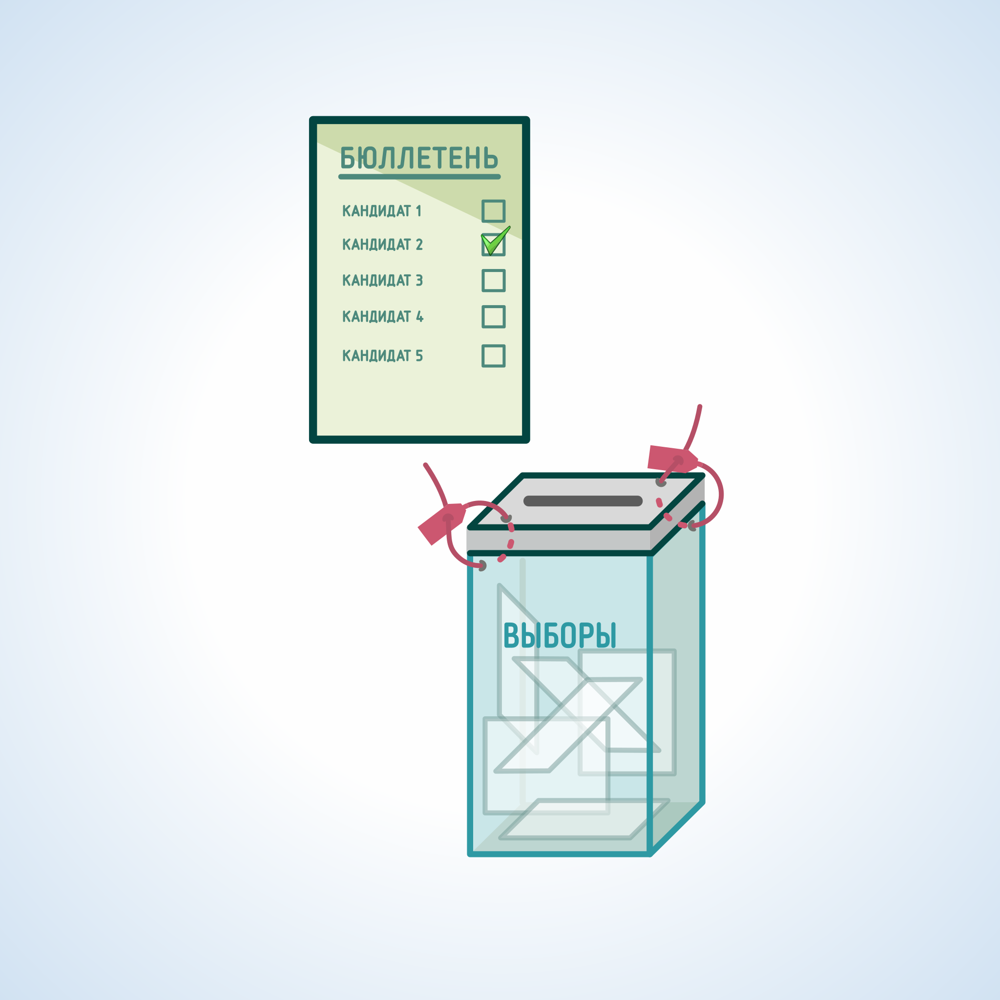

#### Урок 10.3. Основные требования к организации и проведению голосования в день голосования {#lesson-4.10.3}

Перед выдачей бюллетеня член УИК обязан удостовериться в том, что избиратель не проголосовал досрочно, письменное заявление (устное обращение) избирателя о предоставлении ему возможности проголосовать вне помещения для голосования не зарегистрировано в специальном реестре и к избирателю не направлены члены УИК с правом решающего голоса для проведения голосования вне помещения для голосования.

При получении бюллетеня избиратель проставляет в списке избирателей серию и номер своего паспорта или документа, заменяющего паспорт гражданина.

С согласия избирателя либо по его просьбе серия и номер предъявляемого им паспорта или документа, заменяющего паспорт гражданина, могут быть внесены в список избирателей членом УИК с правом решающего голоса. Избиратель проверяет правильность произведенной записи и расписывается в получении бюллетеня. Член УИК, выдавший избирателю бюллетень, также расписывается в соответствующей графе списка избирателей. В случае проведения голосования по нескольким бюллетеням избиратель расписывается за каждый бюллетень.

Голосование проводится путем нанесения избирателем в бюллетене любого знака в квадрате, относящемуся к кандидату или списку кандидатов, в пользу которого сделан выбор.

Каждый избиратель голосует лично. Избирательный бюллетень заполняется в кабине или ином специально оборудованном месте для тайного голосования, где присутствие других лиц недопустимо, за исключением случая, когда избиратель не может самостоятельно расписаться в получении избирательного бюллетеня или заполнить избирательный бюллетень.

Избиратель, не имеющий возможности самостоятельно расписаться в получении бюллетеня или заполнить бюллетень, вправе воспользоваться для этого помощью другого избирателя, не являющегося членом комиссии, зарегистрированным кандидатом, уполномоченным представителем избирательного объединения, доверенным лицом кандидата, избирательного объединения, наблюдателем. В этом случае избиратель устно извещает УИК о своем намерении воспользоваться помощью для заполнения бюллетеня. При этом в соответствующей графе списка избирателей указываются фамилия, имя, отчество, серия и номер паспорта или документа, заменяющего паспорт, лица, оказывающего помощь избирателю.

Заполненный избирательный бюллетень избиратель опускает в стационарный ящик для голосования.

Если избиратель считает, что при заполнении бюллетеня совершил ошибку, он вправе обратиться к члену УИК, выдавшему бюллетень, с просьбой выдать ему новый бюллетень взамен испорченного. Член комиссии выдает избирателю новый бюллетень, делает соответствующую отметку в списке избирателей против фамилии данного избирателя и расписывается. Испорченный бюллетень, на котором член комиссии с правом решающего голоса делает соответствующую запись и заверяет ее своей подписью, заверяется также подписью секретаря УИК, после чего такой бюллетень незамедлительно погашается, о чем составляется акт.

Председатель УИК следит за порядком в помещении для голосования. Распоряжения председателя УИК, отданные в пределах его компетенции, обязательны для всех присутствующих в помещении для голосования. В отсутствие председателя УИК его полномочия исполняет заместитель председателя УИК, а в его отсутствие - секретарь УИК или иной член данной комиссии с правом решающего голоса, уполномоченный ею.

При проведении голосования, подсчете голосов избирателей и составлении протокола об итогах голосования УИК в помещении для голосования, в помещении УИК вправе находиться следующие лица:

- члены вышестоящих комиссий и работники аппарата Избирательной комиссии Хабаровского края;
- кандидаты;
- уполномоченные представители по финансовым вопросам кандидатов;
- доверенные лица кандидатов;
- уполномоченные представители или доверенные лица избирательных объединений;
- наблюдатели.

Эти лица вправе осуществлять наблюдение как непрерывно, так и в свободно выбираемые ими промежутки времени. В течение всего периода наблюдения, им обеспечивается свободный доступ в помещение, где проводятся голосование и подсчет голосов избирателей. Список лиц, осуществлявших наблюдение за ходом голосования и подсчетом голосов избирателей, составляется УИК на основе представленных данными лицами документов.

В 20:00 часов по местному времени председатель УИК объявляет, что получить избирательные бюллетени и проголосовать могут только избиратели, уже находящиеся в помещении для голосования, после чего объявляет об окончании голосования.

Член участковой комиссии немедленно отстраняется от участия в ее работе, а наблюдатель и иные лица удаляются из помещения для голосования, если они нарушают законодательство Российской Федерации о выборах и референдумах и факт такого нарушения установлен в судебном порядке.
