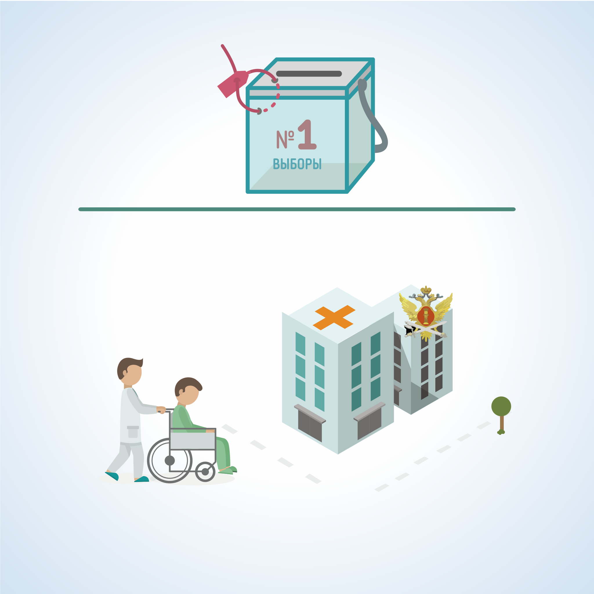

#### Урок 11.1. Работа участковой избирательной комиссии по организации и проведению голосования избирателей вне помещения для голосования {#lesson-11.1}

Голосовать вне помещения для голосования имеют право избиратели, которые включены в список избирателей или имеют право быть включенными в список избирателей на данном избирательном участке, но не могут самостоятельно прибыть в помещение для голосования по следующим причинам:

1. состояние здоровья; 
2. инвалидность; 
3. нахождение в местах содержания под стражей подозреваемых и обвиняемых в совершении преступлений. 

