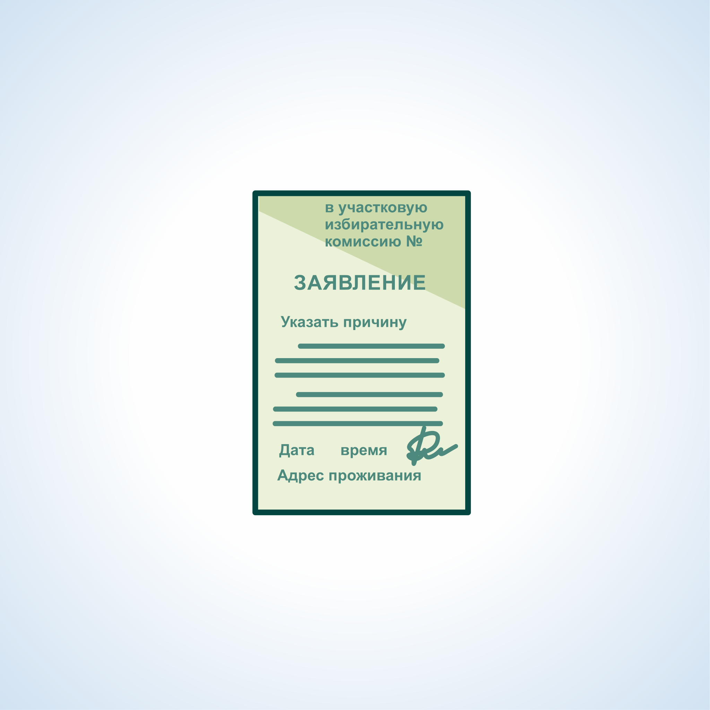
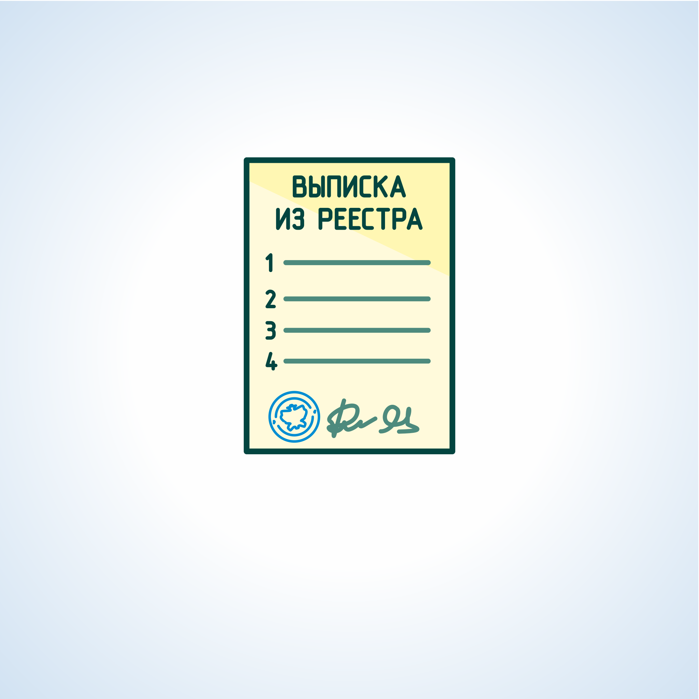

#### Урок 11.2. Подача заявлений (устных обращений) для предоставления возможности избирателям проголосовать вне помещения для голосования {#lesson-11.2.2}

Избиратели, имеющие право голосовать вне помещения для голосования, обязаны уведомить об этом УИК письменным заявлением или устным обращением о предоставлении такой возможности.

Заявление (устное обращение) может быть подано как самим избирателем, так и при помощи других лиц, в том числе зарегистрированными кандидатами, членами УИК с правом решающего или совещательного голоса.

Избиратель вправе обратиться в УИК в течение 10 дней до дня голосования, но не позднее 14.00 по местному времени в день голосования.
Если заявление (устное обращение) поступило в УИК позже указанного времени, то оно не подлежит удовлетворению, о чем незамедлительно извещается избиратель или лицо, с чьей помощью предоставлено заявление (устное обращение).
Члены УИК непосредственно в день подачи регистрируют все поданные заявления (устные обращения) в реестре заявлений, который по окончании голосования хранится вместе со списком избирателей.
При регистрации заявления (устного обращения) в реестре указываются:
- время поступления;
- фамилия, имя, отчество избирателя;
- адрес места жительства;
- причина, по которой избиратель не может прибыть в помещение для голосования;
- ставится подпись члена УИК, который принял  заявление (устное обращение).

Если заявление (устное обращение) передано при содействии другого лица, в реестре также указываются фамилия, имя, отчество и адрес места жительства лица, передавшего заявление (устное обращение).

Члены УИК вправе признать неуважительной причину, по которой избиратель не может самостоятельно прибыть в помещение для голосования, и на этом основании отказать избирателю в проведении голосования вне помещения для голосования. О принятом решении, об отказе в проведении такого голосования, комиссия немедленно извещает избирателя.
