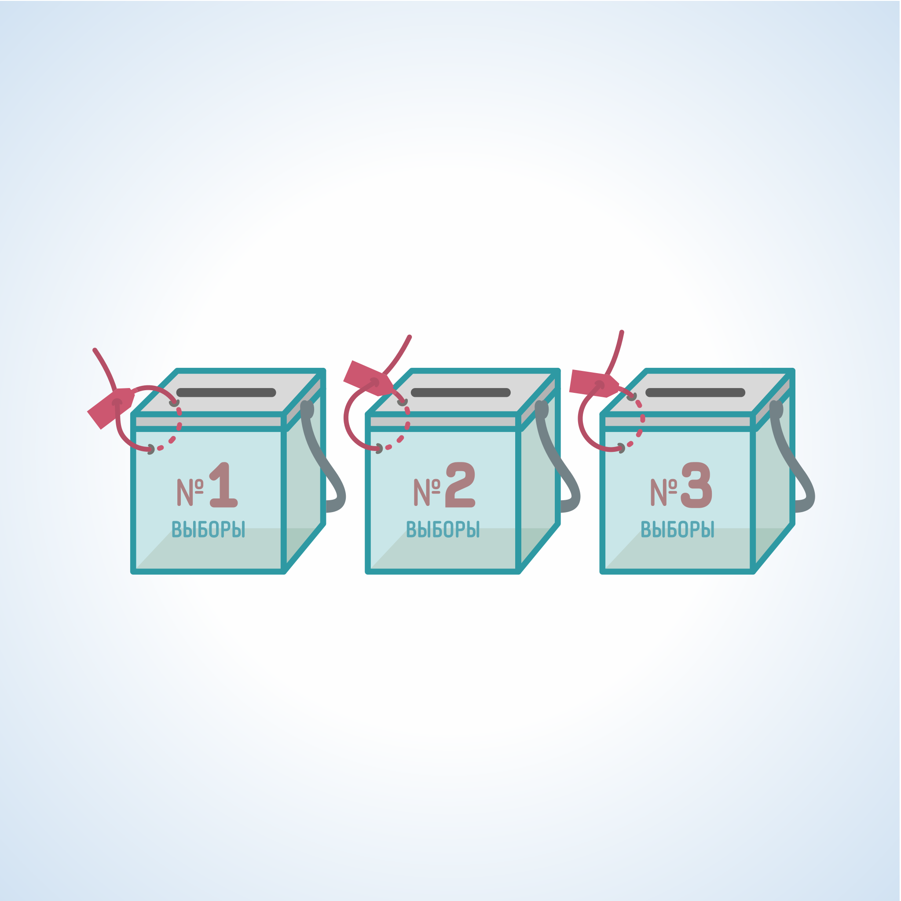
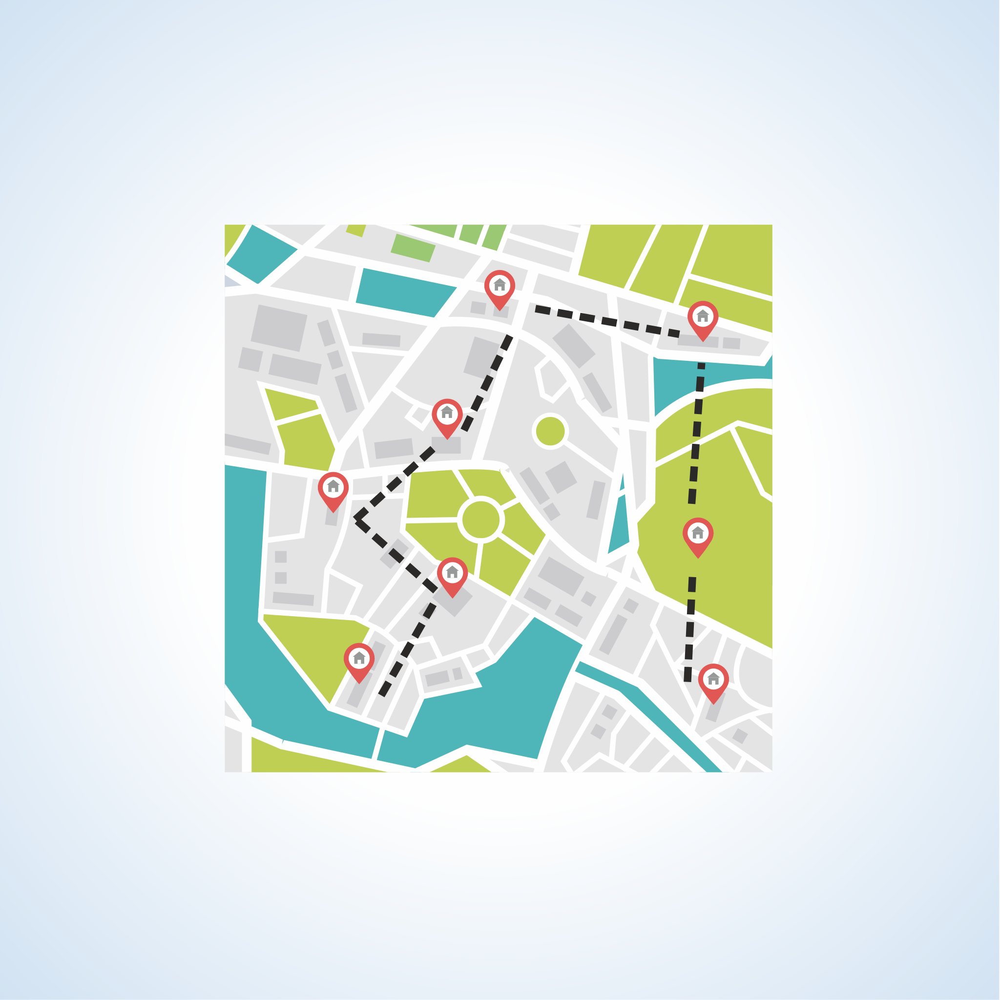
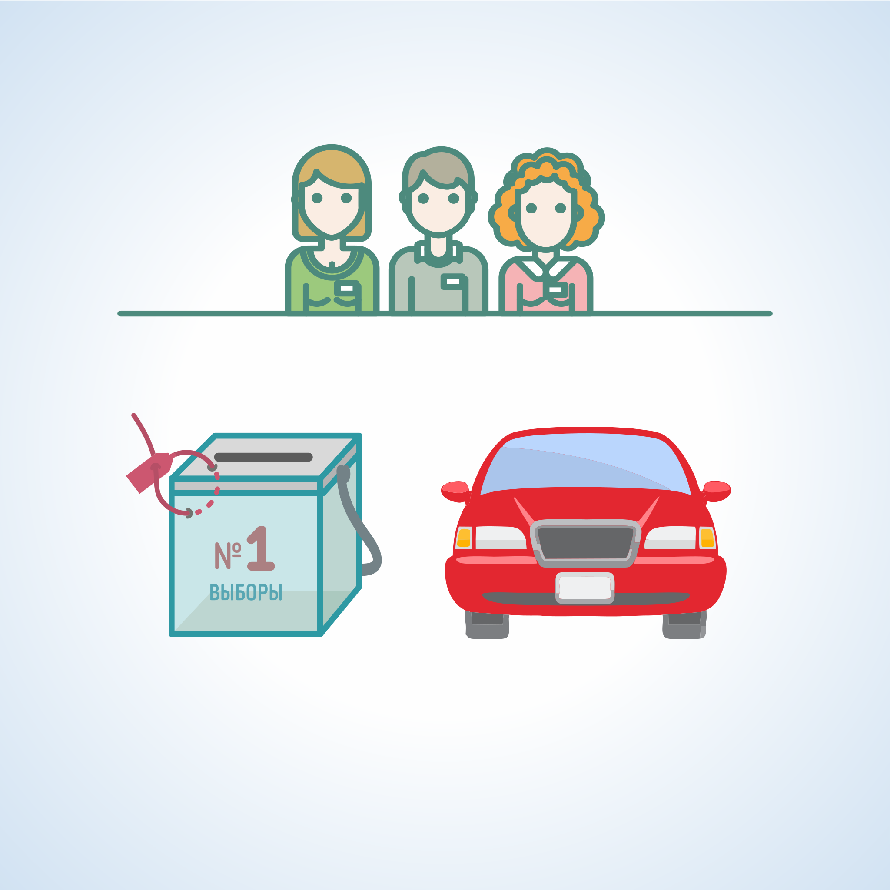
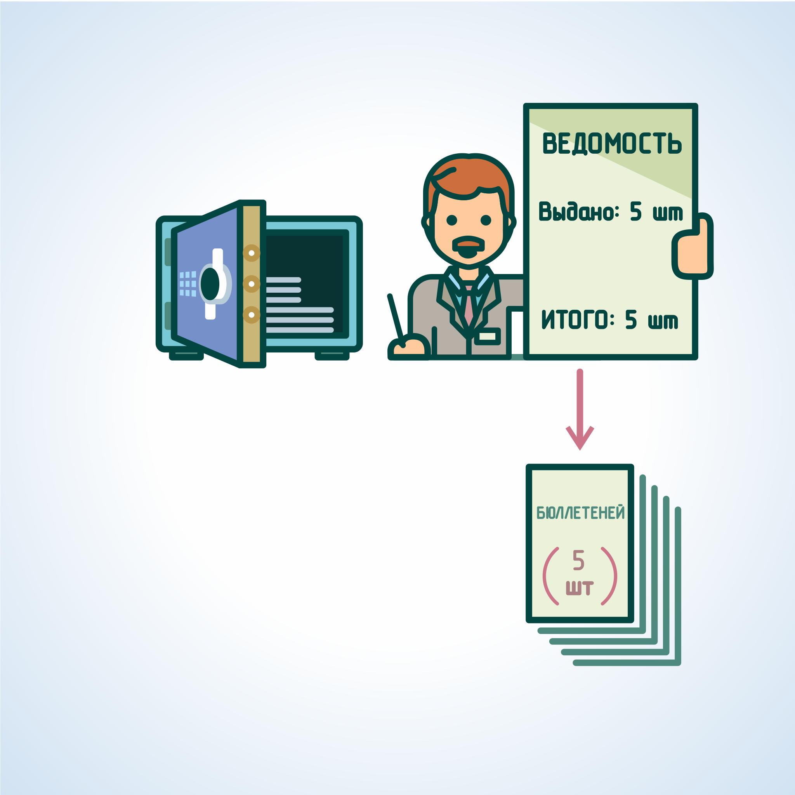
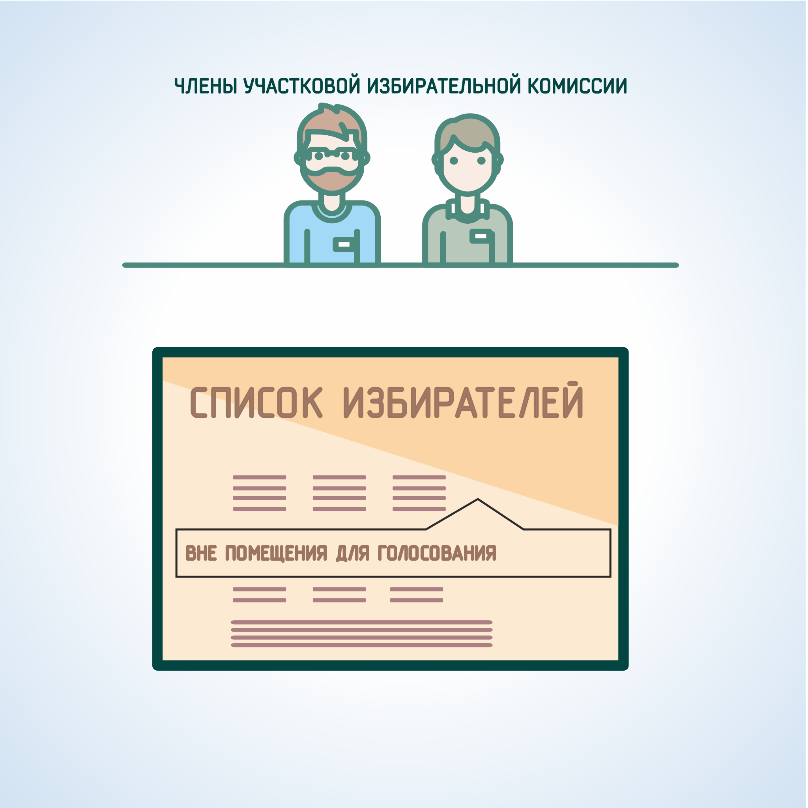
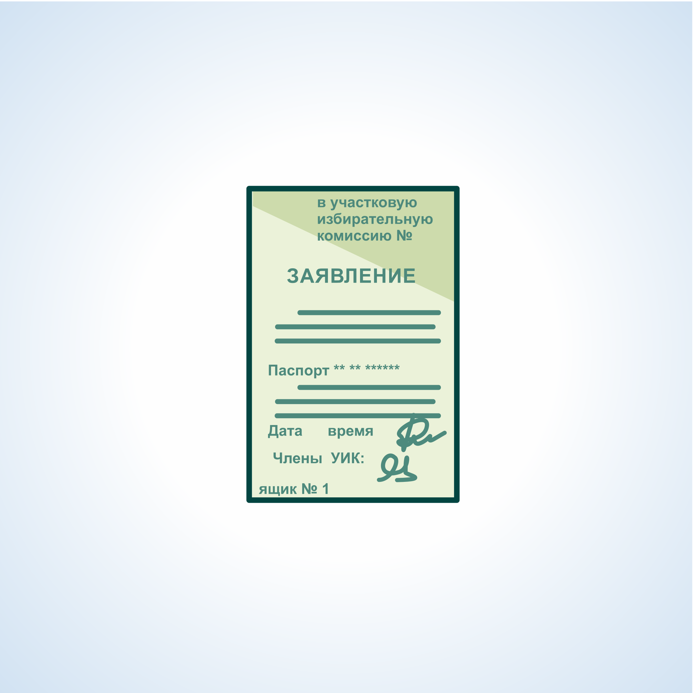
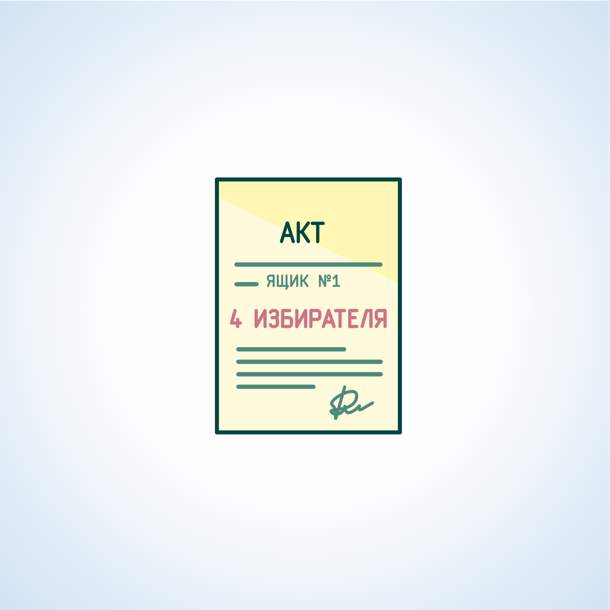

#### Урок 11.3. Порядок организации голосования избирателей вне помещения для голосования {#lesson-11.3}

Для проведения голосования вне помещения для голосования УИК должна располагать необходимым количеством переносных ящиков для голосования.

Количество переносных ящиков для проведения голосования вне помещения для голосования определяется решением вышестоящей избирательной комиссии.

При этом максимальное количество используемых в день голосования переносных ящиков для голосования вне помещения для голосования зависит от числа зарегистрированных на территории избирательного участка избирателей, и составляет:

1. до 501 избирателя - 1 ящик; 
2. от 501 до 1001 избирателя - 2 ящика; 
3. более 1000 избирателей - 3 ящика.

Решением избирательной комиссии муниципального образования, количество используемых переносных ящиков для голосования вне помещения для голосования, может быть увеличено, но не более чем на один при наличии условий, определенных в части 6.1. статьи 82 Избирательного кодекса Хабаровского края.

Переносные ящики для голосования в обязательном порядке нумеруются.

На заседании УИК необходимо при распределении обязанностей среди членов УИК с правом решающего голоса в день голосования определить ответственных за организацию и проведение голосования вне помещения для голосования.

Заблаговременно необходимо подготовить бланки следующих документов:

- ведомости передачи бюллетеней членам УИК для проведении голосования вне помещения для голосования;
- акта о проведении голосования вне помещения для голосования;
- заявления избирателя о предоставлении возможности проголосовать вне помещения для голосования;
- реестра заявлений избирателей;
- выписки из реестра заявлений избирателей;
- акта о погашении испорченного бюллетеня для голосования.

Секретарь УИК или ответственные члены УИК определяют наиболее оптимальные маршруты движения для проведения голосования вне помещения для голосования и формирует выписки из реестра заявлений избирателей о предоставлении им возможности проголосовать вне помещения для голосования.

Председатель УИК объявляет о том, что члены комиссии с правом решающего голоса будут проводить голосование вне помещения для голосования, не позднее, чем за 30 минут до предстоящего выезда (выхода), а также предлагает членам УИК с правом совещательного голоса и наблюдателям присутствовать при его проведении.

При этом УИК должна обеспечить не менее чем двум лицам из числа членов с правом совещательного голоса, наблюдателей, назначенных разными политическими партиями, равные с проводящими голосование вне помещения для голосования членами этой комиссии с правом решающего голоса возможности прибытия к месту проведения голосования.

Голосование вне помещения для голосования проводят не менее двух членов УИК с правом решающего голоса.

Голосование вне помещения для голосования может быть проведено одним членом УИК с правом решающего голоса при условии, что при этом присутствуют не менее двух лиц из числа членов УИК с правом совещательного голоса, наблюдателей, назначенных разными кандидатами, избирательными объединениями.

Секретарь УИК выдает реестр или заверенную выписку из реестра членам УИК, выезжающим для проведения голосования вне помещения для голосования.

Члены УИК, выезжающие проводить голосование вне помещения, получают бюллетени по ведомости.

Общее число получаемых бюллетеней не может превышать более чем на 5% число полученных заявлений, но не может быть менее двух бюллетеней.

При выезде для проведения голосования вне помещения для голосования члены УИК с правом решающего голоса должны иметь:

- опечатанный (опломбированный) и пронумерованный переносной ящик для голосования;
- необходимое количество избирательных бюллетеней для голосования;
- заверенную выписку из реестра регистрации заявлений о голосовании вне помещения для голосования либо сам реестр;
- письменные заявления избирателей о предоставлении возможности проголосовать вне помещения для голосования, если они поступили в УИК;
- бланки и образцы заявлений избирателей для оформления их по месту нахождения избирателей;
- необходимые письменные принадлежности (бумага, ручки, за исключением карандашей);
- информационные материалы (по возможности).

В список избирателей вносится отметка о том, что к соответствующему избирателю выехали (вышли) члены УИК: «Вне помещения для голосования____».

По прибытии членов УИК к избирателю, устное обращение избирателя о предоставлении возможности проголосовать вне помещения для голосования подтверждается письменным заявлением.

В письменном заявлении избирателя должна быть указана причина, по которой избиратель не может прибыть в помещение для голосования. В заявлении должны содержаться фамилия, имя и отчество избирателя, адрес его места жительства.

На заявлении избиратель проставляет серию и номер своего паспорта или документа, заменяющего паспорт гражданина, и своей подписью удостоверяет получение бюллетеня.

С согласия избирателя либо по его просьбе серия и номер паспорта или документа, заменяющего паспорт гражданина, могут быть внесены в заявление членом УИК с правом решающего голоса.

Члены УИК с правом решающего голоса своими подписями на заявлении удостоверяют факт выдачи бюллетеня. В заявлении также делаются отметки о получении нового бюллетеня взамен испорченного, а в случае получения избирателем, двух и более бюллетеней (с учетом вида выборов и совмещения выборов) - об общем количестве полученных бюллетеней.

По окончании голосования заявление хранится вместе со списком избирателей.

Если избиратель вследствие инвалидности или по состоянию здоровья не имеет возможности самостоятельно расписаться в получении бюллетеня или заполнить бюллетень, он вправе воспользоваться для этого помощью другого избирателя, не являющегося членом комиссии, зарегистрированным кандидатом, уполномоченным представителем избирательного объединения, доверенным лицом кандидата, избирательного объединения, наблюдателем, в порядке.

В таком случае избиратель устно извещает комиссию о своем намерении воспользоваться помощью для заполнения бюллетеня. При этом в заявлении о предоставлении возможности проголосовать вне помещения для голосования указываются фамилия, имя, отчество, серия и номер паспорта или документа, заменяющего паспорт, лица, оказывающего помощь избирателю.

Члены УИК, выехавшие проводить голосование вне помещения для голосования, вправе выдать бюллетени только тем избирателям, заявления (устные обращения) которых зарегистрированы в имеющемся у членов УИК реестре или выписки из реестра.

По возвращению на избирательный участок члены УИК составляют акт о проведении голосования вне помещения для голосования, в котором указываются: 

- количество бюллетеней, выданных членам УИК с правом решающего голоса, проводившим голосование вне помещения для голосования;
- количество письменных заявлений избирателей, о предоставлении им возможности проголосовать вне помещения для голосования;
- количество выданных избирателям, и возвращенных (неиспользованных, испорченных избирателями) бюллетеней;
- сведения о членах УИК с правом решающего голоса, проводивших голосование вне помещения для голосования, членах УИК с правом совещательного голоса и наблюдателях;
- присутствовавших при проведении голосования вне помещения для голосования.

После составления акта прорезь для бюллетеней в переносном ящике для голосования вне помещения для голосования опечатывается (пломбируется) председателем УИК.

Хранение переносных ящиков в пределах видимости членов УИК и наблюдателей обеспечивает секретарь УИК.

Члены УИК с правом решающего голоса, проводившие голосование вне помещения для голосования, вносят в список избирателей серию и номер паспорта или документа, заменяющего паспорт, избирателей, проголосовавших вне помещения для голосования, а также продолжают начатую перед выездом (выходом) к избирателю запись: "Вне помещения для голосования проголосовал", а также ставятся подписи указанных членов УИК.

Если к избирателю по его заявлению уже направились члены УИК для проведения голосования вне помещения для голосования, а этот избиратель прибыл в помещение для голосования, то члены УИК не вправе выдавать данному избирателю в помещении для голосования бюллетень до возвращения выехавшей группы и установления факта, что указанный избиратель не проголосовал вне помещения для голосования.
