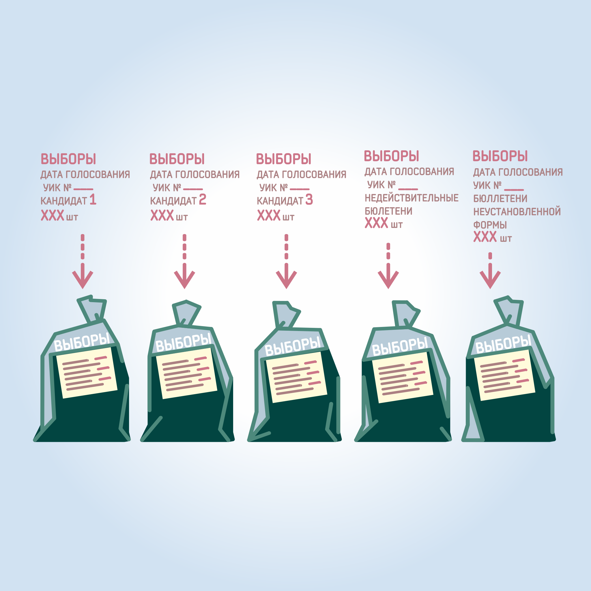

#### Урок 12.7. Работа с избирательными бюллетенями {#lesson-4.12.7}

После завершения подсчета избирательных бюллетеней они упаковываются в отдельные пачки по зарегистрированным кандидатам, за которые поданы голоса в соответствующих избирательных бюллетенях. В отдельные пачки упаковываются недействительные, погашенные избирательные бюллетени, избирательные бюллетени неустановленной формы. На каждой пачке указывается число содержащихся в ней избирательных бюллетеней, фамилия зарегистрированного кандидата либо ставится одна из следующих отметок: «Недействительные бюллетени», «Избирательные бюллетени неустановленной формы» и т.д.

Упакованные избирательные бюллетени складываются в мешки или коробки, на которых указывается наименование выборов, дата голосования, номер избирательного участка, общее число всех упакованных избирательных бюллетеней. Мешки или коробки опечатываются и могут быть вскрыты только по решению вышестоящей избирательной комиссии или суда.

