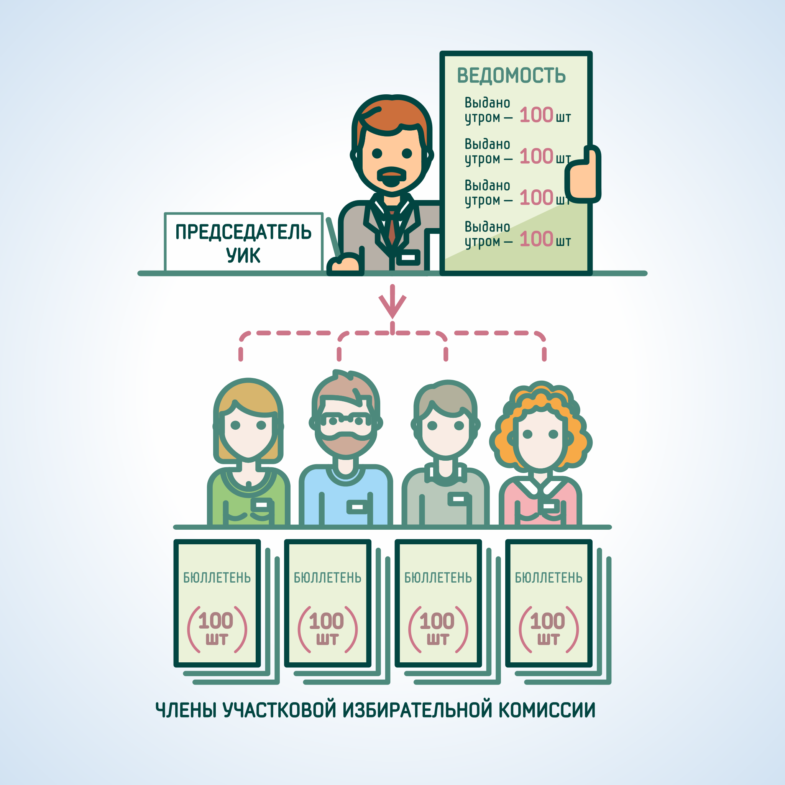

#### Урок 13.1. Погашение неиспользованных избирательных бюллетеней {#lesson-13.1}

##### 1. Сбор неиспользованных бюллетеней у членов комиссии

Перед началом подсчета неиспользованных бюллетеней члены комиссии с правом решающего голоса, выдававшие бюллетени избирателям в день голосования, сдают неиспользованные бюллетени председателю или секретарю комиссии. Возврат бюллетеней осуществлялся под роспись в ведомости.

##### 2. Выемка неиспользованных бюллетеней из сейфа (металлического шкафа)

Неиспользованные бюллетени, хранившиеся в сейфе (металлическом шкафу) участковой комиссии вынимаются и смешиваются с возвращенными членами комиссии бюллетенями. Если бюллетени были заранее расфасованы и хранились в сейфе в пачках по 50 (100) бюллетеней, то допускается оставить такие бюллетени в пачках для удобства дальнейшего подсчета.

##### 3. Подсчет неиспользованных бюллетеней

С согласия участников наблюдения контролируется число бюллетеней в случайно выбранных пачках. В случае отсутствия такого согласия или если бюллетени не были расфасованы по пачкам, необходимо произвести полный полистный пересчет неиспользованных бюллетеней. Подсчет неиспользованных бюллетеней завершается оглашением полученного результата.

##### 4. Погашение неиспользованных бюллетеней

После подсчета неиспользованных бюллетеней осуществляется их погашение путем отрезания левого нижнего угла. Допускается погашение бюллетеней с использованием ножниц, резаков и иными доступными и не травмоопасными способами.

С погашенными бюллетенями вправе визуально ознакомиться присутствующие при подсчете голосов лица под контролем членов комиссии с правом решающего голоса.

##### 5. Внесение сведений в протокол

К числу неиспользованных бюллетеней прибавляется число испорченных избирателями бюллетеней, которые были погашены в течение дня голосования (при наличии). Результат суммирования заносится в протокол и его увеличенную форму в строку: «Число погашенных бюллетеней».

Ведомость передачи бюллетеней

Ф.И.О. члена комиссии | Получено членом комиссии, шт.
----------------------|------------------------------
Иванова А. И. | 100
Подпись члена комиссии, время | Иванова, 7:51
Петрова Р. Н. | 100
Подпись члена комиссии, время | Петрова, 7:50
Сидорова Н. П. | 100
Подпись члена комиссии, время | Сидорова, 7:51
Галкин Л. Д. | 100
Подпись члена комиссии, время | Галкин, 7:52
**ИТОГО** | **400**

Председатель ______ *Маркина А.В.*

Секретарь _________ *Дмитриева К.Н*

