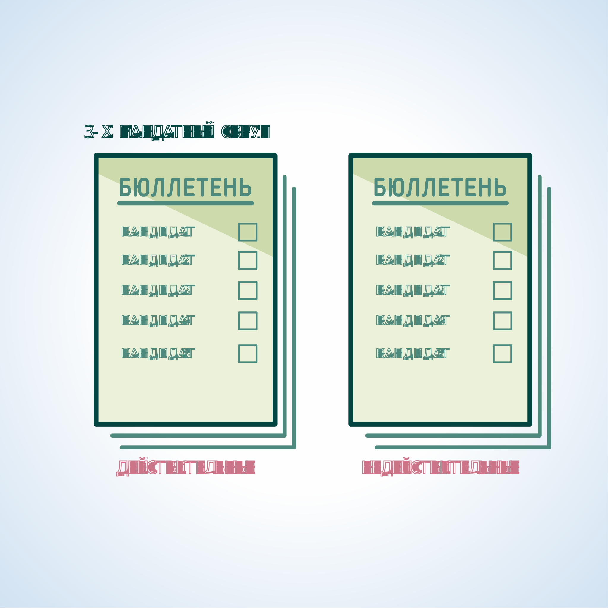

#### Урок 13.4. Особенности подсчета голосов избирателей и составления протокола участковой избирательной комиссии об итогах голосования в многомандатном избирательном округе {#lesson-13.4}

При проведении выборов по многомандатным избирательным округам сортировка бюллетеней по фамилиям кандидатов не производится.

Вначале оглашается общее количество отметок в конкретном бюллетене и, тем самым, определяется действительность или недействительность каждого бюллетеня.

Число отметок избирателя в бюллетене не должно превышать число замещаемых на выборах мандатов в округе.

