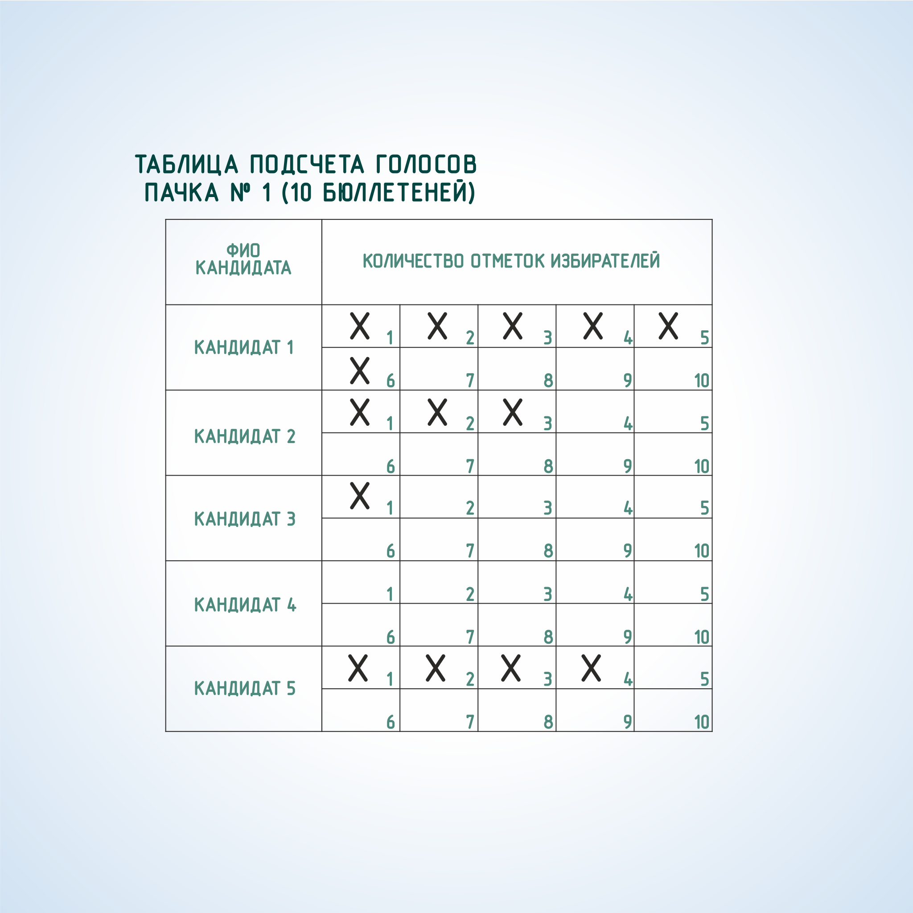

#### Урок 13.4. Особенности подсчета голосов избирателей и составления протокола участковой избирательной комиссии об итогах голосования в многомандатном избирательном округе {#lesson-13.4}

При проведении выборов по многомандатным избирательным округам сортировка бюллетеней по фамилиям кандидатов не производится.

Вначале оглашается общее количество отметок в конкретном бюллетене и, тем самым, определяется действительность или недействительность каждого бюллетеня.

Число отметок избирателя в бюллетене не должно превышать число замещаемых на выборах мандатов в округе.

Рекомендуется предварительно распределить бюллетени на пачки по 10 или 50 бюллетеней для более удобного итогового суммирования голосов избирателей и подсчета числа действительных бюллетеней.

Бюллетени представляются присутствующим для визуального контроля, а данные об отметках оглашаются и вносятся в специальную таблицу учета голосов и суммируются. Голоса избирателей учитываются в таблице путем зачеркивания поочередно чисел напротив фамилии соответствующего кандидата.

Участковой комиссии рекомендуется проводить параллельный одновременный учет голосов не менее чем двумя членами УИК с правом решающего голоса при оглашении отметок из каждого бюллетеня, что позволит дополнительно проверить правильность подсчетов. Рекомендуется также разместить членов УИК, заполняющих таблицы, за другим столом, на котором не находятся бюллетени для голосования.

После заполнения таблиц члены УИК суммируют данные по каждому кандидату, записывают итоговое значение в графе «Всего» и оглашают данные.

Затем эти данные и число недействительных бюллетеней вносятся в протокол УИК об итогах голосования и его увеличенную форму.
