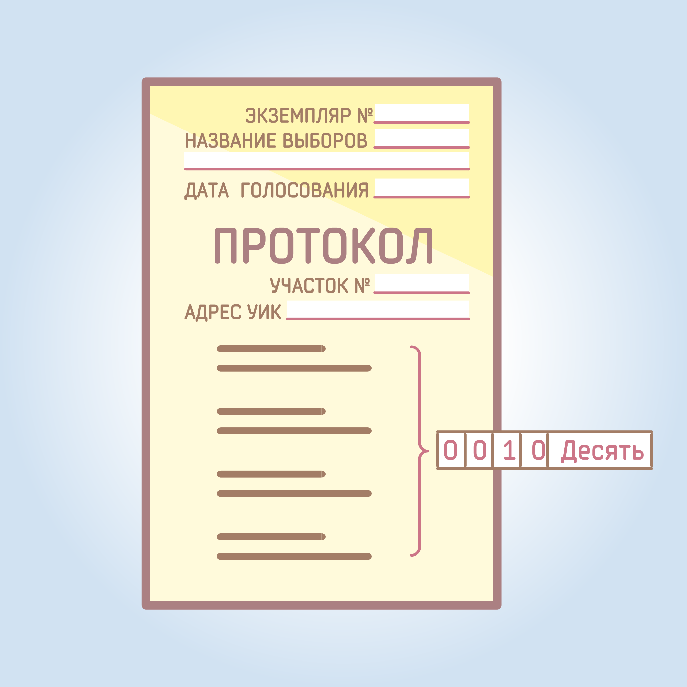

#### Урок 14.1. Оформление протокола {#lesson-14.1}

Участковая комиссия оформляет свое решение об итогах голосования протоколом. Протокол составляется в 2 экземплярах и должен быть подписан всеми присутствующими членами комиссии с правом решающего голоса.

Протокол об итогах голосования может быть составлен в электронном виде и затем распечатан. Либо он может быть составлен путем заполнения бланка рукописным способом.

Протокол об итогах голосования должен содержать в обязательном порядке следующие данные:
- номер экземпляра;
- дату голосования;
- адрес помещения для голосования с указанием номера избирательного участка;
- заполненные строки протокола (цифры вносятся в предназначенные для этих целей клетки, все из которых подлежат обязательному заполнению с ведущими нулями. Значения по всем строкам протокола вносятся цифрами и прописью);
 - ФИО председателя, заместителя председателя, секретаря и других членов комиссии с правом решающего голоса и их подписи;
- дату и время подписания протокола;
- печать участковой комиссии.

