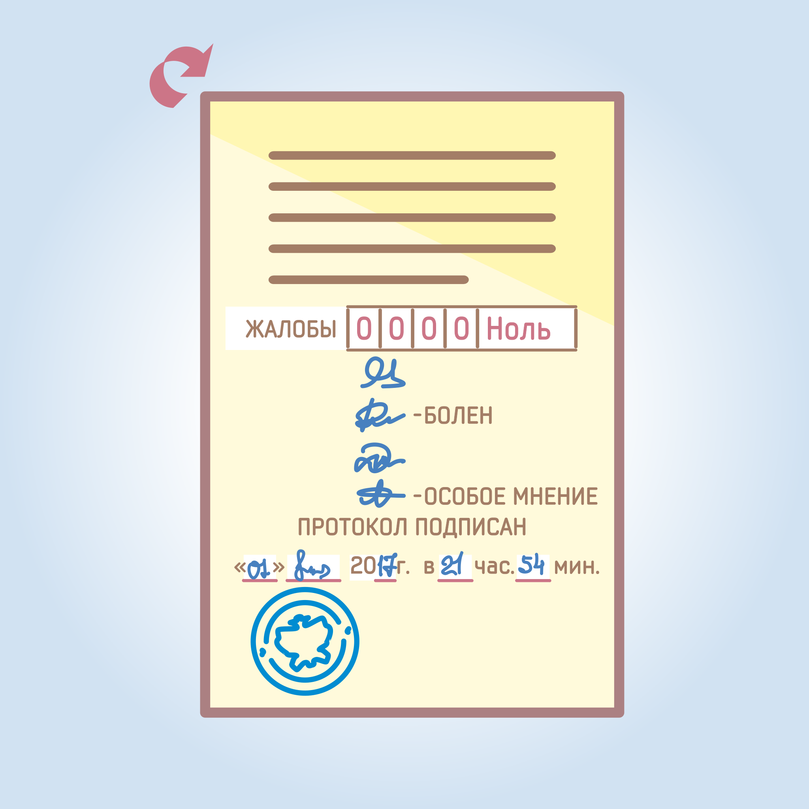

#### Урок 14.3. Подписание протокола об итогах голосования, внесение записей об отсутствии членов участковой избирательной комиссии {#lesson-14.3}

После рассмотрения жалоб (заявлений) на нарушения закона, допущенные при голосовании и подсчете голосов избирателей, подписывается протокол участковой комиссии об итогах голосования. В нем проставляются дата и время (часы и минуты) его подписания.

Если во время заполнения протокола об итогах голосования некоторые члены комиссии с правом решающего голоса отсутствуют, в протоколе делается об этом запись с указанием причины их отсутствия, например «Болен», «Командировка» и т.д. Запись заверяется подписью председателя, либо заместителя председателя, либо секретаря участковой комиссии. 

Протокол является действительным, если он подписан большинством от установленного числа членов комиссии с правом решающего голоса. Если при подписании протокола подпись хотя бы одного члена комиссии проставлена другим комиссии или посторонним лицом, это является основанием для признания данного протокола недействительным и проведения повторного подсчета голосов избирателей.

При подписании протокола комиссии об итогах голосования члены участковой комиссии с правом решающего голоса, несогласные с протоколом в целом или с его отдельными положениями, вправе приложить к протоколу особое мнение, о чем в протоколе делается соответствующая запись.
