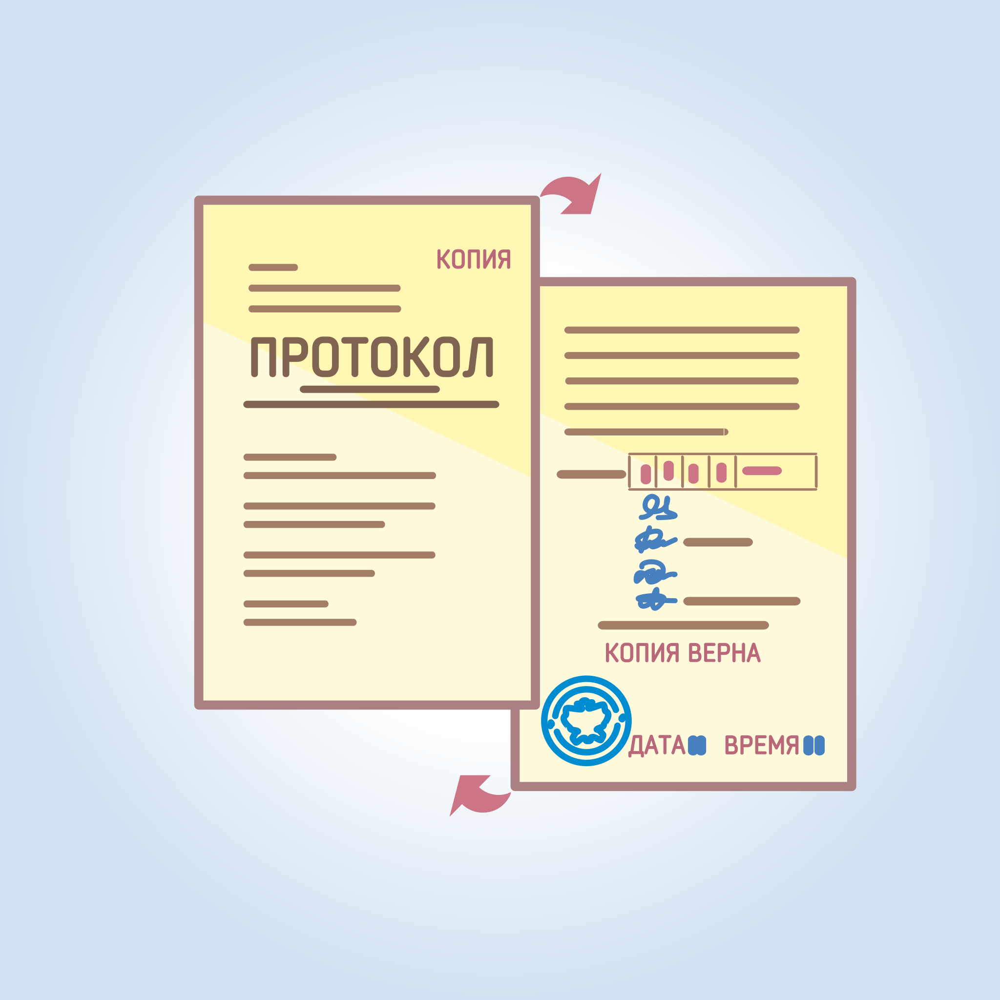

#### Урок 14.4 Выдача заверенных копий протоколов об итогах голосования {#lesson-14.4}

По требованию члена участковой комиссии, наблюдателя, иных лиц участковая комиссия немедленно после подписания протокола об итогах голосования обязана выдать указанным лицам заверенную копию протокола об итогах голосования. Если протокол составлен в электронном виде, его копия изготавливается путем распечатки протокола на бумажном носителе. 

Выдаваемые заверенные копии протоколов нумеруются. Участковая комиссия отмечает факт выдачи заверенной копии в соответствующем реестре. Копию протокола об итогах голосования вправе заверять председатель, заместитель председателя или секретарь комиссии. Лицо, получившее заверенную копию, расписывается в указанном реестре.

Копия протокола об итогах голосования заверяется в следующем порядке:
- на лицевой стороне копии протокола в правом верхнем углу проставляется  надпись "Копия";
- после строк протокола либо надписи с указанием даты и времени составления протокола, делает запись "Верно" или "Копия верна";
- указываются ФИО, должность в избирательной комиссии, ставится подпись лица, заверяющего копию;
- указывается дата и время (часы, минуты) заверения и проставляется печать участковой комиссии.

В случае если копия протокола об итогах голосования составляется более чем на одном листе, каждый ее лист заверяется в вышеуказанном порядке.
Ответственность за соответствие в полном объеме данных, содержащихся в копии протокола об итогах голосования, данным, содержащимся в протоколе, несет лицо, заверившее указанную копию протокола.

В случае если копия протокола изготавливается без применения копировальной техники, указание в копии протокола фамилий, имен и отчеств членов участковой комиссии и проставление их подписей не требуются.
