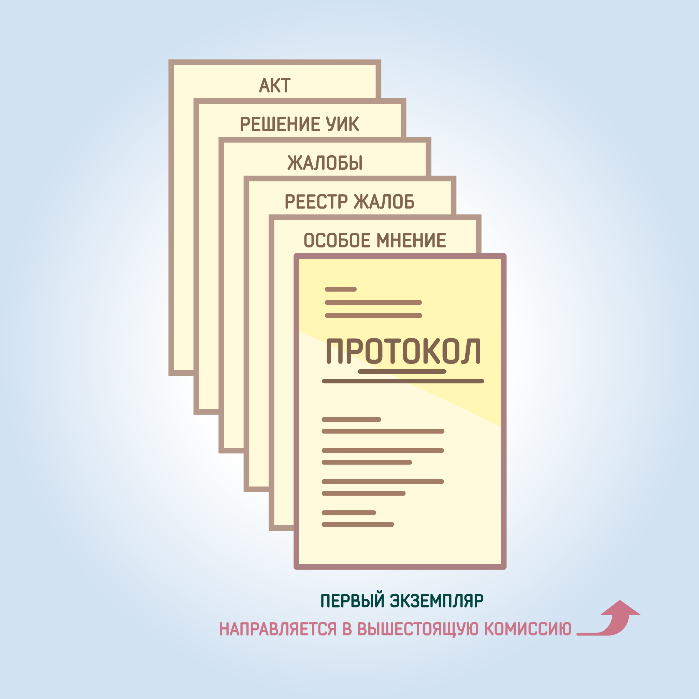

#### Урок 14.5. Первый экземпляр протокола участковой комиссии {#lesson-14.5}

Первый экземпляр протокола участковой комиссии об итогах голосования после его подписания и выдачи заверенных копий незамедлительно направляется в вышестоящую комиссию и возврату в участковую комиссию не подлежит.

К первому экземпляру протокола прилагаются:
- особые мнения членов участковой комиссии с правом решающего голоса;
- жалобы (заявления) поступившие в участковую комиссию в день голосования и до окончания подсчета голосов избирателей;
- решения участковой комиссии принятые по жалобам (заявлениям);
- акты и реестры, составленные участковой комиссией.

Заверенные копии вышеуказанных документов и решений участковой избирательной комиссии прилагаются ко второму экземпляру протокола.

Первый экземпляр протокола с приложенными к нему документами доставляется в вышестоящую комиссию председателем, секретарем или иным членом участковой избирательной комиссии с правом решающего голоса по поручению ее председателя. При передаче протокола вправе присутствовать другие члены участковой избирательной комиссии, а также наблюдатели, направленные в данную участковую избирательную комиссию.

