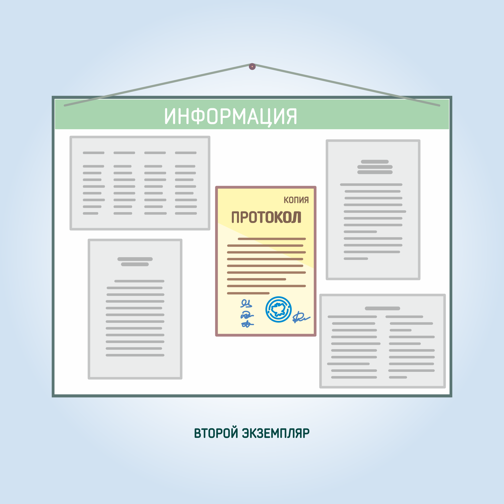

#### Урок 14.6. Второй экземпляр протокола участковой комиссии {#lesson-4.14.6}

Второй экземпляр протокола участковой комиссии об итогах голосования предоставляется для ознакомления лицам, присутствующим при подведении итогов голосования, а его заверенная копия вывешиваются для всеобщего ознакомления в месте, установленном участковой избирательной комиссией.

Второй экземпляр протокола с заверенными копиями документов, приложенными к первому экземпляру протокола, включая бюллетени, списки членов участковой комиссии с правом совещательного голоса, иных лиц, а также печать участковой комиссии передаются в территориальную комиссию для хранения.

