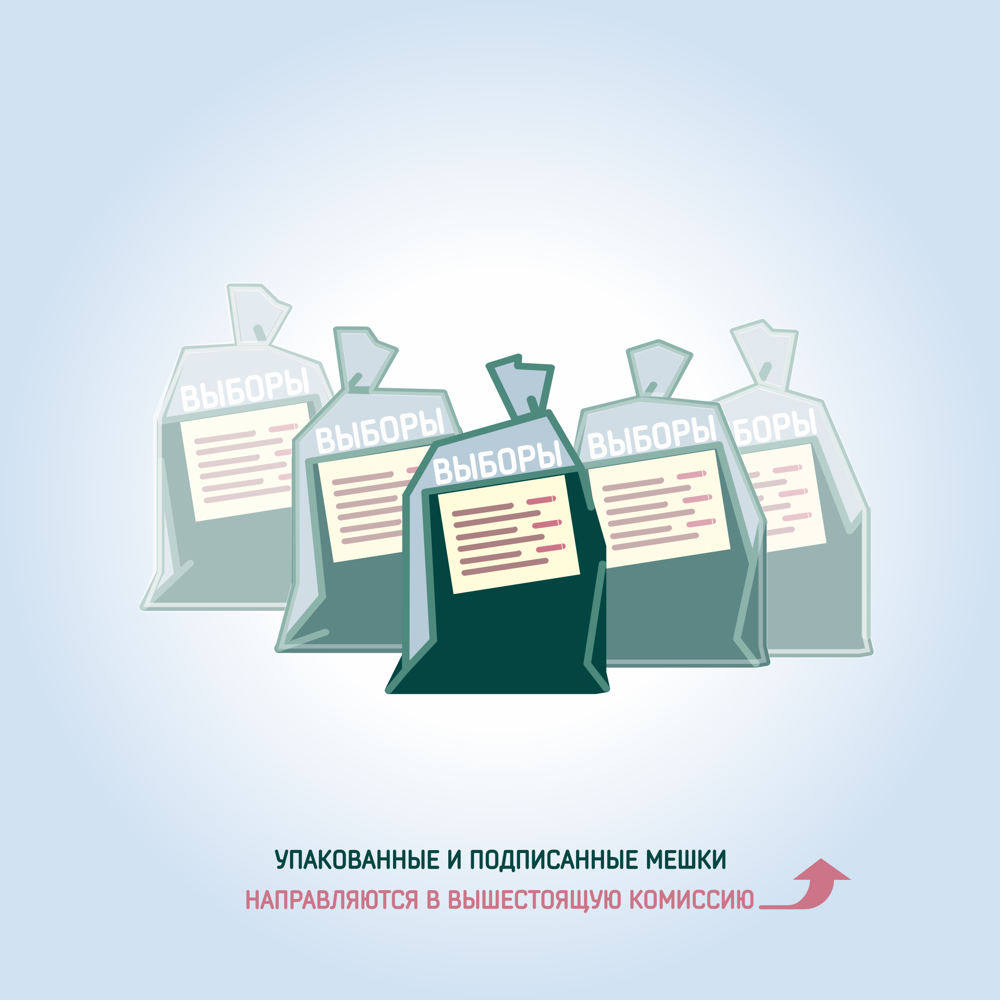

#### Урок 14.7. Подготовка избирательной документации для сдачи в вышестоящую избирательную комиссию {#lesson-14.7}

После завершения подсчета голосов избирателей участковая комиссия упаковывает рассортированные бюллетени в отдельные пачки по фамилиям зарегистрированных кандидатов. В отдельные пачки упаковываются недействительные, погашенные избирательные бюллетени, бюллетени неустановленной формы. На каждой пачке указывается число содержащихся в ней избирательных бюллетеней, фамилия зарегистрированного кандидата, либо ставится одна из следующих отметок: «Недействительные бюллетени», «Избирательные бюллетени неустановленной формы» и т.д.

Упакованные избирательные бюллетени складываются в мешки или коробки, на которых указывается наименование выборов, дата голосования, номер избирательного участка, общее число всех упакованных избирательных бюллетеней. Мешки или коробки опечатываются и могут быть вскрыты только по решению вышестоящей избирательной комиссии или суда. Также рекомендуется в мешок или коробку упаковывать увеличенную форму протокола.

Список избирателей с приложенными к нему всеми официальными документами уполномоченных органов, а также личными письменными заявлениями граждан, поступившими в УИК в период уточнения списка избирателей, упаковываются в отдельный мешок или коробку, на котором (которой) указывается: «Список избирателей».

В каждый мешок (коробку) вкладывается опись содержащихся в нем избирательных документов. Мешки или коробки опечатываются печатью УИК, заверяются подписью председателя (в случае его отсутствия – заместителя председателя или секретаря) УИК и могут быть вскрыты только по решению вышестоящей избирательной комиссии или суда.
