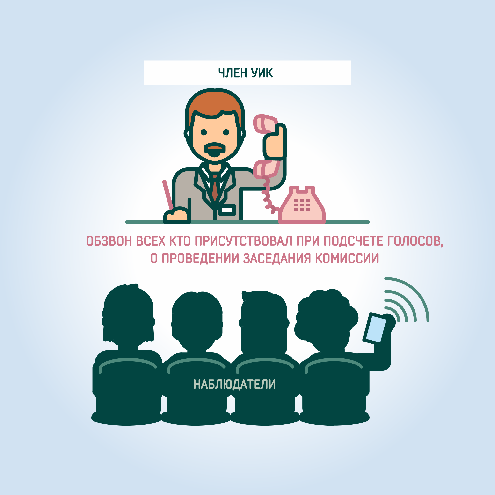
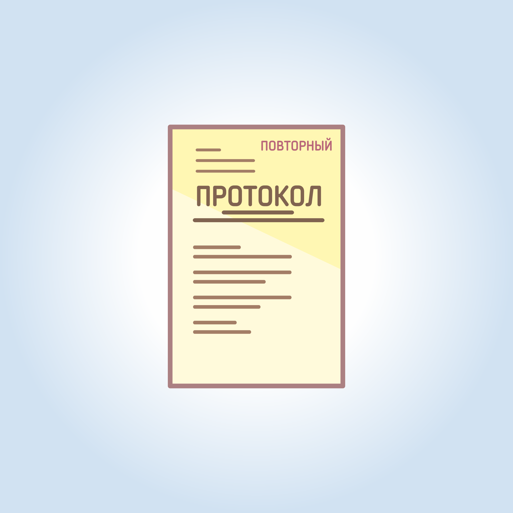

#### Урок 14.8. Повторный подсчет голосов. Повторный протокол {#lesson-14.8}

Если после подписания протокола об итогах голосования и направления его первого экземпляра в территориальную комиссию, в ходе предварительной проверки выявлены неточность (описка, опечатка), комиссия, направившая протокол, обязана на своем заседании рассмотреть вопрос о внесении уточнений в строки 1-11, 11ж и 11з протокола об итогах голосования. 

О принятом решении комиссия в обязательном порядке информирует своих членов с правом совещательного голоса, наблюдателей и других лиц, присутствовавших при составлении ранее утвержденного протокола, а также представителей средств массовой информации. 

В этом случае комиссия составляет протокол об итогах голосования, на котором делается отметка: "Повторный". Указанный протокол незамедлительно направляются в вышестоящую комиссию. Нарушение указанного порядка составления повторного протокола и повторной сводной таблицы является основанием для признания этого протокола недействительным. 

В случае, если требуется внести уточнения в строку 12 и последующие строки протокола об итогах голосования, проводится повторный подсчет голосов в установленном законом порядке.

